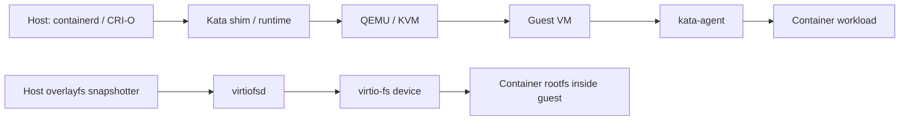
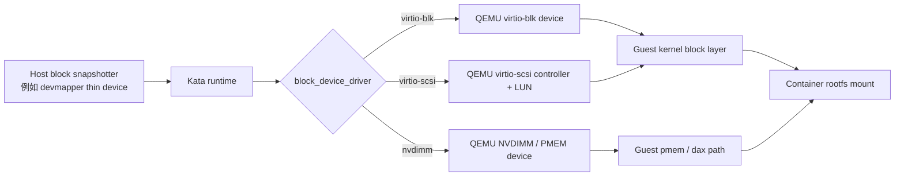
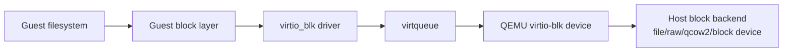

# Kata Containers 中 virtio-scsi、virtio-blk、NVDIMM 对比说明

> 适用场景：Kata Containers + QEMU 场景下，理解 `block_device_driver = "virtio-scsi" / "virtio-blk" / "nvdimm"` 三种方式的概念、架构、I/O 路径、优缺点，以及它们和 Guest VM rootfs、容器 rootfs、virtio-fs、PMEM/DAX 的关系。

---

## 1. 先给结论

在 Kata + QEMU 里，这三者本质上是 **把宿主机上的块设备或镜像暴露给 Guest VM 的三种设备模型**：

| 方案 | 本质 | Guest 内常见设备形态 | 主要特点 | 典型适用 |
|---|---|---|---|---|
| `virtio-blk` | Virtio 块设备 | `/dev/vdX` | 简单、路径短、开销小 | 单盘/少量块设备、追求简单低延迟 |
| `virtio-scsi` | Virtio SCSI Host + SCSI LUN | `/dev/sdX` 或实际以 guest 为准 | 更通用，适合多盘、热插拔、SCSI 语义 | 多块设备、热插拔、通用块存储 |
| `nvdimm` | QEMU 模拟 NVDIMM/PMEM 内存设备 | `/dev/pmemX`、`/dev/pmemXpY` | 可配合 DAX，绕过传统块 I/O 路径 | 只读镜像、快速启动、DAX/XIP、实验性 PMEM 场景 |

**最容易混淆的一点：**

Kata 里至少有两层 rootfs：

1. **Guest VM rootfs**：虚拟机自己的根文件系统，来自 Kata 的 guest image，例如 `kata-containers.img`。
2. **容器 workload rootfs**：真正业务容器看到的 `/`，来自容器镜像 snapshotter，例如 overlayfs、devmapper 等。

这三种 `block_device_driver` 主要影响的是：当 **容器 rootfs 背后是块设备** 时，Kata 怎么把这个块设备交给 QEMU/Guest VM。它不是普通 overlayfs + virtio-fs 场景下的必经路径。

---

## 2. Kata 文档里怎么说

Kata 的 QEMU 配置模板明确写了：

```toml
# Block storage driver to be used for the hypervisor in case the container
# rootfs is backed by a block device. This is virtio-scsi, virtio-blk
# or nvdimm.
block_device_driver = "..."
```

也就是说，`virtio-scsi`、`virtio-blk`、`nvdimm` 是 **container rootfs backed by block device** 时使用的 hypervisor block storage driver。

Kata 配置模板还写到：

```toml
# If set block storage driver (block_device_driver) to "nvdimm",
# should set memory_offset to the size of block device.
memory_offset = 0
```

说明 `nvdimm` 不只是换一个磁盘控制器，它还涉及 VM 内存地址空间预留，因为 NVDIMM/PMEM 是通过内存映射方式暴露给 Guest 的。

Kata storage 文档还有一个关键判断：

- 如果使用 block-based graph driver，例如 devicemapper snapshotter，Kata 可以把底层块设备直接传给 Guest VM；
- 如果不是 block-based graph driver，通常使用 `virtio-fs` 把 workload 镜像共享给 Guest；
- devicemapper 这种块级 snapshotter 直接用块设备，理论上 I/O 性能比通过 `virtio-fs` 共享文件系统更好。

---

## 3. 大架构：Kata 存储路径位置

### 3.1 普通 virtio-fs 路径



特点：

- 容器 rootfs 通常通过 `virtio-fs` 共享进 Guest；
- Guest VM rootfs 和容器 rootfs 是两回事；
- 你在容器内 `findmnt -T /` 看到 `/` 是 `virtiofs`，说明当前 workload rootfs 走的是 virtio-fs，而不是 `block_device_driver` 那条块设备路径。

### 3.2 block snapshotter 路径



特点：

- 只有容器 rootfs 背后确实是块设备时，这三种 driver 才真正有对比意义；
- 如果 snapshotter 还是 overlayfs，主要瓶颈和路径会落在 virtio-fs，而不是 `virtio-blk` / `virtio-scsi` / `nvdimm`。

---

## 4. 基本概念

## 4.1 virtio 是什么

`virtio` 是虚拟化场景下的一组半虚拟化设备规范。它的目标是：让 Guest 看到一个标准化的虚拟设备，Guest 内核用 virtio 驱动，Host/QEMU 负责后端实现，从而比传统全设备模拟更高效。

在存储里常见的 virtio 设备有：

- `virtio-blk`：直接暴露一个简单块设备；
- `virtio-scsi`：暴露一个 SCSI host，下面可以挂多个 target/LUN；
- `virtio-fs`：共享文件系统，不是块设备；
- `virtio-pmem`：Virtio 规范里的持久内存设备，和 Kata 配置项里的 QEMU `nvdimm` 不是完全同一个东西。

---

## 4.2 virtio-blk

### 一句话理解

`virtio-blk` 就是 **一个虚拟磁盘**。Guest 里面通常看到 `/dev/vda`、`/dev/vdb` 这类设备。

### 架构



### 特点

优点：

- 路径短，模型简单；
- 对单盘、少量盘场景通常更直接；
- 设备名直观，Guest 里通常是 `/dev/vdX`；
- Kata 配置中 `enable_iothreads` 对 `virtio-blk` 生效，可以让 I/O 在单独 IOThread 处理。

缺点：

- 每个盘通常是一个独立 virtio-blk 设备；
- 管理大量磁盘、复杂热插拔、SCSI 语义时不如 virtio-scsi 通用；
- 对容器场景来说，只有当 rootfs 背后是块设备时才有意义。

### 适合什么

- 简单块设备；
- 少量磁盘；
- 想减少设备模型复杂度；
- 想做 `virtio-blk` 和 `virtio-scsi` 的纯块设备性能对比。

---

## 4.3 virtio-scsi

### 一句话理解

`virtio-scsi` 不是直接给你一个盘，而是给 Guest 一个 **虚拟 SCSI Host Adapter**，这个 Host Adapter 下面可以挂多个 SCSI target/LUN。Guest 里面常见表现是 `/dev/sdX`，但实际设备名要以 guest 内 `lsblk` / `findmnt` 为准。

### 架构


### 特点

优点：

- 更像传统企业存储模型：Host / Target / LUN；
- 一个 virtio-scsi controller 可以管理多个 LUN；
- 支持控制队列、事件队列、请求队列，更适合热插拔和设备变更通知；
- 对多盘、多 LUN、复杂块设备管理更友好；
- Kata 配置中 `enable_iothreads` 也对 `virtio-scsi` 生效。

缺点：

- 比 virtio-blk 多一层 SCSI mid-layer，路径更复杂；
- 单盘极简场景下，不一定比 virtio-blk 更快；
- 具体性能要看 QEMU、Guest kernel、队列数、IOThread、AIO、后端存储。

### 适合什么

- 多块设备；
- 需要热插拔；
- 更接近传统虚拟机存储模型；
- Kata 默认配置或发行版配置选择 virtio-scsi 时，可以先按它作为 baseline。

---

## 4.4 NVDIMM / PMEM / DAX

### 一句话理解

`nvdimm` 不是传统“磁盘控制器”，而是 QEMU 给 Guest 模拟一个 **非易失内存设备**。Guest 里面通常看到 `/dev/pmem0`、`/dev/pmem0p1`。它可以配合 DAX，让 Guest 直接把文件映射到内存地址空间，减少传统块 I/O 和 page cache 路径。

### 架构

```mermaid
flowchart LR
    A[Host backing file / block image] --> B[mmap / memory-backend-file]
    B --> C[QEMU NVDIMM device]
    C --> D[Guest physical address space]
    D --> E[Guest pmem driver]
    E --> F[/dev/pmem0 / partition]
    F --> G[ext4/xfs dax mount 或 rootfs]
```

### DAX 是什么

DAX，全称 Direct Access。它的核心是：

- 文件系统绕过传统 page cache；
- 应用/内核可以直接访问持久内存映射区域；
- 适合只读镜像、快速启动、XIP（Execute In Place）等场景；
- 性能收益主要来自减少复制、减少 page cache、减少传统块设备请求路径。

Kata 架构文档里提到：QEMU 场景下，Kata 使用 **NVDIMM memory device with memory file backend** 来配合 DAX，把 guest image 映射成 VM rootfs。这个 rootfs 会通过类似 `/dev/pmem*` 的设备被 guest kernel 挂载。

### 在 Kata 里需要特别注意

Kata QEMU 配置里有两个相关但容易混淆的参数：

```toml
block_device_driver = "nvdimm"
memory_offset = 0
```

如果 `block_device_driver = "nvdimm"`，配置说明要求 `memory_offset` 设置为 block device 的大小。这是因为 NVDIMM 要占用 Guest 的物理地址空间。

另外还有：

```toml
disable_image_nvdimm = false
```

这个参数控制 **Guest VM image** 是否通过 NVDIMM 插入。它和 `block_device_driver` 对容器 rootfs 块设备的处理不是同一个层次。

---

## 5. 三者核心对比

| 对比项 | virtio-blk | virtio-scsi | nvdimm |
|---|---|---|---|
| 设备模型 | 简单 virtio block device | virtio SCSI Host + target/LUN | QEMU NVDIMM/PMEM 内存设备 |
| Guest 常见设备 | `/dev/vdX` | `/dev/sdX`，实际以系统为准 | `/dev/pmemX`、`/dev/pmemXpY` |
| I/O 语义 | 块 I/O | SCSI 命令 + 块 I/O | 内存映射 + flush/persist 语义 |
| 路径复杂度 | 最短 | 多一层 SCSI mid-layer | 不走传统块设备路径，偏 memory mapping |
| 多设备管理 | 一般 | 强 | 不适合当普通多盘控制器用 |
| 热插拔 | 可以，但模型较简单 | 更适合 | 不是主要优势 |
| DAX | 否 | 否 | 是主要价值之一 |
| Kata 配置项 | `block_device_driver="virtio-blk"` | `block_device_driver="virtio-scsi"` | `block_device_driver="nvdimm"` |
| IOThread | Kata 配置说明支持 | Kata 配置说明支持 | 不按传统 IOThread 块路径理解 |
| 优势 | 简单、低开销 | 通用、可扩展、多 LUN | 快速启动、少复制、绕过 guest page cache |
| 风险/限制 | 多盘管理一般 | 路径更复杂 | DAX 支持、架构支持、安全问题、地址空间配置、历史漏洞影响 |

---

## 6. I/O 路径差异

### 6.1 virtio-blk 路径

```text
Container 文件读写
  -> Guest VFS / filesystem
  -> Guest block layer
  -> virtio_blk
  -> virtqueue
  -> QEMU virtio-blk
  -> Host backend block/file
```

这个路径短，所以理论上单设备场景比较直接。

### 6.2 virtio-scsi 路径

```text
Container 文件读写
  -> Guest VFS / filesystem
  -> Guest block layer
  -> SCSI mid-layer
  -> virtio_scsi
  -> virtqueue requestq
  -> QEMU virtio-scsi HBA
  -> SCSI LUN backend
  -> Host backend block/file
```

比 virtio-blk 多 SCSI 语义层，但换来更好的设备管理能力。

### 6.3 nvdimm 路径

```text
Container / Guest 文件访问
  -> Guest VFS / DAX filesystem
  -> pmem / dax mapping
  -> Guest physical memory mapping
  -> QEMU NVDIMM memory backend
  -> Host mmap backing file/block image
```

重点不是“提交一个块请求”，而是“把后端映射进 Guest 地址空间”。如果 DAX 真正生效，读路径可以绕过 guest page cache。

---

## 7. 和 Guest VM rootfs、容器 rootfs 的关系

## 7.1 Guest VM rootfs

Guest VM rootfs 是 Kata VM 自己启动需要的系统盘，例如：

```text
kata-containers.img
  -> QEMU 启动 VM
  -> Guest kernel 挂载为 VM rootfs
  -> kata-agent 在 VM rootfs 中启动
```

在 Kata 文档描述的 DAX 场景里，QEMU 可以用 NVDIMM memory device + memory file backend 把这个 guest image 高效映射进去。

## 7.2 容器 workload rootfs

容器 rootfs 是业务容器看到的 `/`，例如 nginx、busybox、ubuntu 镜像展开后的文件系统。

它可能走两条路：

```text
普通 overlayfs snapshotter
  -> virtio-fs
  -> container rootfs
```

或者：

```text
block snapshotter/devmapper
  -> virtio-scsi / virtio-blk / nvdimm
  -> Guest 内挂载为 container rootfs
```

所以你测试时一定要先确认：

```bash
findmnt -T / -o TARGET,SOURCE,FSTYPE,OPTIONS
cat /proc/mounts | grep -E 'virtiofs|pmem|vd|sd'
lsblk -f
```

如果容器内 `/` 是 `virtiofs`，那当前业务容器 rootfs 并没有走 `virtio-scsi` / `virtio-blk` / `nvdimm` 的块设备路径。

---

## 8. 实际怎么判断当前走的是哪种

## 8.1 看 Kata 配置

宿主机上：

```bash
kata-runtime kata-env | grep -Ei 'block_device_driver|disable_block_device_use|shared_fs|image|nvdimm|virtio'

# 或直接看配置文件
CONF=/opt/kata/share/defaults/kata-containers/configuration-qemu.toml
# 也可能是 /etc/kata-containers/configuration.toml
grep -nE 'block_device_driver|disable_block_device_use|disable_image_nvdimm|memory_offset|shared_fs|virtio_fs' "$CONF"
```

重点看：

```toml
disable_block_device_use = false
block_device_driver = "virtio-scsi" # 或 virtio-blk / nvdimm
shared_fs = "virtio-fs"
disable_image_nvdimm = false
memory_offset = 0
```

## 8.2 容器内看 rootfs

```bash
findmnt -T / -o TARGET,SOURCE,FSTYPE,OPTIONS
mount | grep -E 'virtiofs|pmem|vd|sd'
lsblk -o NAME,MAJ:MIN,SIZE,FSTYPE,MOUNTPOINTS,MODEL
```

粗略判断：

| 现象 | 可能路径 |
|---|---|
| `/` FSTYPE 是 `virtiofs` | 容器 rootfs 走 virtio-fs |
| `/` SOURCE 类似 `/dev/vda` | 可能是 virtio-blk 或文档示例路径，需要结合 `lsblk -d -o NAME,MODEL` 看 |
| `/` SOURCE 类似 `/dev/sda` | 可能是 virtio-scsi LUN |
| 出现 `/dev/pmem0`、`/dev/pmem0p1` | NVDIMM/PMEM 路径 |
| mount options 有 `dax` | DAX 明确生效 |
| ext4 挂载没有 `dax` | 不能证明 NVDIMM 没有，但说明文件系统没有以 dax 方式挂载 |

---

## 9. 性能侧怎么理解

## 9.1 virtio-blk vs virtio-scsi

理论倾向：

- `virtio-blk`：路径更短，单盘、小规模 I/O 场景可能更直接；
- `virtio-scsi`：路径更通用，多盘、多 LUN、热插拔、管理能力更强；
- 两者都可以受益于 IOThread、AIO、io_uring、队列数、宿主机后端盘性能。

不能简单说哪个一定快。要按 workload 看：

| 测试类型 | 更能说明什么 |
|---|---|
| `fio` 顺序读写 | 后端吞吐、缓存策略、AIO 路径 |
| `fio` 4k randread/randwrite | 块设备随机 I/O、队列能力 |
| 小文件 stat/open/read | 文件系统元数据路径，不只是块设备能力 |
| UnixBench | 综合系统调用/进程/文件操作，不适合单独证明 block driver 优劣 |

## 9.2 nvdimm / DAX

`nvdimm` 的性能优势不在“比 virtio-blk 多快一点”，而在于它换了路径：

- 映射式访问；
- 绕过 guest page cache；
- demand paging；
- 对只读镜像启动、共享页面、XIP 更有意义。

但它也有明显限制：

- DAX 是否支持依赖 QEMU、Guest kernel、Kata 版本、架构；
- 在 ARM64 上你之前遇到 `vhost-user-fs-pci.cache-size not found`，本质上就说明某些 DAX/缓存相关能力并不是所有平台/版本都能用；
- 如果 DAX 被禁用，NVDIMM 方案的主要卖点会明显下降；
- 作为可写容器 rootfs，要关注一致性、flush、安全边界和历史漏洞。

---

## 10. 对你当前 Kata + PMEM/DAX 方案的判断口径

结合你之前的测试现象：

```text
findmnt -T / 显示：/ none virtiofs rw,relatime
/proc/mounts 里：none / virtiofs rw,relatime
```

这说明当前容器业务 rootfs 是 virtio-fs，不是 PMEM/NVDIMM 直接作为容器 rootfs。

如果你的目标是：

```text
容器 rootfs = virtio-fs
Guest VM rootfs = PMEM/NVDIMM
容器内对 Guest rootfs 分区做 ro,dax 二次挂载测试
```

那你实际上验证的是：

1. Guest VM image 是否通过 NVDIMM/PMEM 暴露；
2. `/dev/pmem0p1` 是否能在容器内被看见/二次挂载；
3. DAX 是否真的生效；
4. 是否还能复现 GHSA-wwj6-vghv-5p64 这类 host backing 被 guest/container 修改的安全问题；
5. 这个路径对容器 workload rootfs 性能提升是否有限。

如果上层需求是“提升 UnixBench 线性度和启动速度”，那建议拆成两个结论：

- **启动速度**：NVDIMM/DAX 可能有意义，因为它主要影响 Guest image/rootfs 映射和启动路径；
- **UnixBench 线性度**：不一定适合用 PMEM/DAX 证明，因为 UnixBench 是综合系统测试，很多子项和 CPU、进程、系统调用、文件系统元数据有关，不是单纯块设备吞吐。

---

## 11. 建议测试矩阵

### 11.1 前置确认

每组测试前固定记录：

```bash
kata-runtime kata-env > kata-env.txt
uname -a
qemu-system-aarch64 --version || qemu-system-x86_64 --version
containerd --version
crictl info | head -100
```

容器内：

```bash
findmnt -T / -o TARGET,SOURCE,FSTYPE,OPTIONS
lsblk -o NAME,MAJ:MIN,SIZE,FSTYPE,MOUNTPOINTS,MODEL
cat /proc/mounts | grep -E 'virtiofs|pmem|vd|sd|dax'
```

### 11.2 对比组合

| 组合 | shared_fs | block_device_driver | snapshotter | 目的 |
|---|---|---|---|---|
| A | virtio-fs | 默认 | overlayfs | 当前常见 baseline |
| B | virtio-fs | virtio-scsi | devmapper/block | 测块设备直通 baseline |
| C | virtio-fs | virtio-blk | devmapper/block | 对比 virtio-blk 单盘路径 |
| D | virtio-fs | nvdimm | devmapper/block | 对比 NVDIMM/PMEM rootfs 路径 |
| E | virtio-fs | 默认 | overlayfs + Guest image NVDIMM | 验证 VM rootfs DAX/启动收益 |

### 11.3 推荐指标

| 指标 | 工具 | 说明 |
|---|---|---|
| 启动耗时 | `kubectl get pod -w`、containerd/kata 日志 | 看 sandbox 创建、VM boot、agent ready |
| 块 I/O | `fio` | 适合 virtio-blk/scsi/nvdimm 对比 |
| 小文件元数据 | 自定义 stat/open/read 脚本 | 适合对比 virtio-fs 和块 rootfs 文件系统 |
| 系统综合 | UnixBench | 只能作为辅助，不能单独证明存储方案优劣 |
| DAX 是否生效 | `mount | grep dax`、`findmnt -o OPTIONS` | 直接确认 dax option |
| 安全验证 | GHSA probe | 验证只读/写穿透/host backing 是否受影响 |

---

## 12. 选择建议

### 12.1 如果只是做稳定可用

优先：`virtio-scsi` 或当前发行版默认值。

理由：

- Kata 文档中早期 storage 描述 block-based graph driver 时就是 virtio-scsi；
- 更适合多盘、热插拔、通用块设备管理；
- 作为 baseline 更容易和默认配置对齐。

### 12.2 如果要做纯性能对比

加入 `virtio-blk`。

理由：

- 路径更短；
- 和 `virtio-scsi` 对比能说明 SCSI 层额外开销是否明显；
- 建议用 `fio`，不要只看 UnixBench。

### 12.3 如果目标是启动速度 / 只读镜像 / DAX

才重点看 `nvdimm`。

理由：

- NVDIMM/DAX 的价值在于 memory mapping、绕过 guest page cache、快速映射 guest image；
- 如果 DAX 被禁用或平台不支持，收益会被削弱；
- 安全问题和只读边界必须单独验证。

### 12.4 如果当前容器 `/` 还是 virtio-fs

不要把 `block_device_driver` 当成主要优化点。

因为这时业务容器 rootfs 的关键路径是：

```text
overlayfs snapshotter -> virtiofsd -> virtio-fs -> container rootfs
```

不是：

```text
devmapper/block -> virtio-scsi/virtio-blk/nvdimm -> container rootfs
```

---

## 13. 一页总结

```text
virtio-blk：
  简单虚拟磁盘，路径短，适合少量块设备和纯性能对比。

virtio-scsi：
  虚拟 SCSI Host，可挂多个 LUN，适合多盘、热插拔、默认/通用场景。

nvdimm：
  模拟持久内存设备，Guest 看到 /dev/pmemX，核心价值是 DAX、映射式访问、启动和只读镜像性能。

Kata 里必须先分清：
  Guest VM rootfs != 容器 workload rootfs。

如果容器内 / 是 virtiofs：
  当前容器 rootfs 没走 virtio-blk/scsi/nvdimm 块设备路径。

如果要比较三者：
  需要 block-based snapshotter/devmapper，并确认 disable_block_device_use=false。
```

---

## 14. 参考资料

1. Kata Containers Architecture：说明 Kata 使用轻量 VM、Guest VM rootfs、容器 rootfs、virtio-fs、DAX、QEMU NVDIMM memory backend 等架构关系。  
   https://raw.githubusercontent.com/kata-containers/kata-containers/main/docs/design/architecture/README.md

2. Kata Containers Storage：说明 block-based graph driver、virtio-scsi、virtio-fs、devicemapper snapshotter、直接使用底层块设备等关系。  
   https://raw.githubusercontent.com/kata-containers/kata-containers/main/docs/design/architecture/storage.md

3. Kata QEMU configuration template：说明 `block_device_driver` 可选 `virtio-scsi`、`virtio-blk`、`nvdimm`，以及 `memory_offset`、`disable_image_nvdimm`、IOThread 等配置。  
   https://raw.githubusercontent.com/kata-containers/kata-containers/main/src/runtime/config/configuration-qemu.toml.in

4. OASIS Virtio 1.2 Specification：说明 virtio block device、virtio SCSI host device、virtio PMEM device 的规范定义。  
   https://docs.oasis-open.org/virtio/virtio/v1.2/virtio-v1.2.html

5. QEMU block drivers reference：说明 QEMU 后端可使用 disk image file 或 host block device。  
   https://www.qemu.org/docs/master/system/qemu-block-drivers.html
