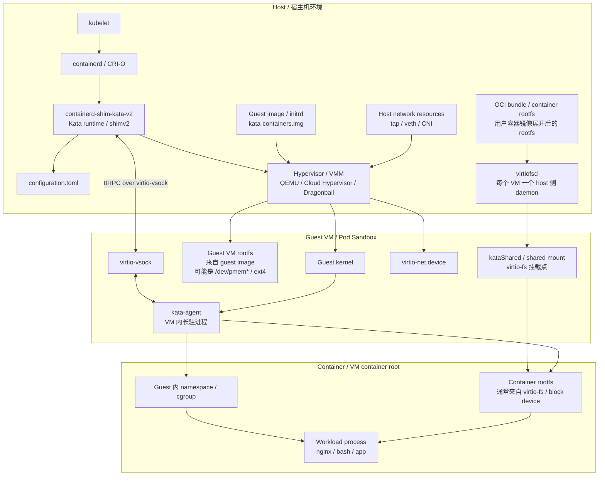
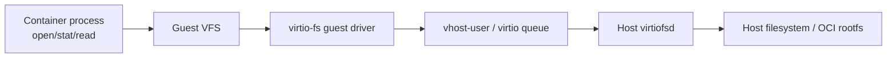
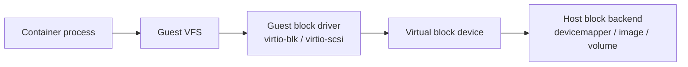
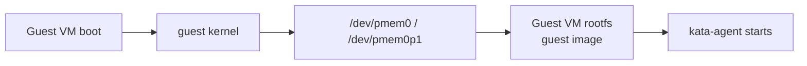
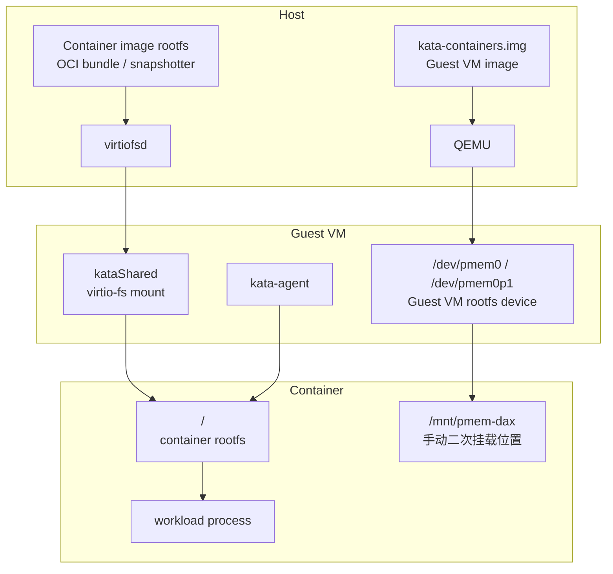

# Kata Containers：Host / Guest VM / Container 架构图与流程

> 目标：从 Kata Containers 的架构设计和源码组件出发，理解 Host、Guest VM、Container 三层之间的关系，以及 Pod 创建、VM 启动、container rootfs 挂载、kata-agent 创建容器、I/O 路径等关键流程。

---

## 1. 一句话理解

Kata Containers 不是直接在 Host 上启动容器进程，而是：

```text
Kubernetes / containerd
  -> containerd-shim-kata-v2
    -> 启动轻量 VM
      -> VM 内 kata-agent
        -> 在 Guest VM 内创建 namespace / cgroup / rootfs
          -> 启动业务容器进程
```

也就是说：

```text
Host 负责接收容器运行时请求，并启动 VM；
Guest VM 提供硬件虚拟化隔离边界；
kata-agent 在 Guest VM 内创建真正的容器环境；
Container 是 Guest VM 内的 namespace / cgroup / process。
```

---

## 2. Host / Guest VM / Container 总体架构图



---

## 3. 三层环境分别是什么

| 层级 | 名称 | 运行位置 | 是否虚拟化 | 是否容器化 | rootfs 来源 |
|---|---|---|---|---|---|
| Host | 宿主机 | 物理机 / 宿主 OS | 否 | 否 | Host 自己的 rootfs |
| Guest VM | VM root | Kata 启动的轻量 VM 内 | 是 | 否 | guest image / initrd |
| Container | VM container root | Guest VM 内 | 是 | 是 | 用户容器镜像 rootfs |

最重要的是区分这三个 rootfs：

```text
Host rootfs
    != Guest VM rootfs
        != Container rootfs
```

容易混淆的点：

```text
kata-containers.img / initrd
    是 Guest VM 用来启动的系统镜像；

busybox / ubuntu / nginx 镜像
    是用户容器 workload 的 rootfs。
```

---

## 4. Kubernetes / CRI 到 Kata 的映射关系

Kata 在 Kubernetes 里的核心映射：

| Kubernetes / CRI 概念 | Kata / VM 概念 | 底层技术 |
|---|---|---|
| Pod Sandbox | Guest VM | Hypervisor / VMM |
| Container | Guest VM 内的进程 | Guest kernel namespace / cgroup |
| Network | 虚拟网卡 | virtio-net / vhost-net / tap |
| Storage | 虚拟块设备或共享文件系统 | virtio-blk / virtio-scsi / virtio-fs |
| Compute | VM 资源 | vCPU / memory / KVM |
| Runtime 通信 | Host runtime 到 Guest agent | virtio-vsock / ttRPC |

整体链路：

```text
Kubelet
  -> CRI(containerd / CRI-O)
    -> Kata Containers runtime
      -> Guest VM
        -> Containers
```

---

## 5. Pod / Container 创建完整流程

### 5.1 Host 侧：kubelet 到 Kata runtime

```text
1. kubelet 创建 Pod
2. kubelet 通过 CRI 调用 containerd / CRI-O
3. containerd 根据 RuntimeClass 选择 Kata runtime
4. containerd 启动 containerd-shim-kata-v2
5. containerd-shim-kata-v2 读取 configuration.toml
6. Kata runtime 根据配置选择 hypervisor
```

关键组件：

```text
containerd-shim-kata-v2
    Kata 的 shimv2 runtime；
    对上接 containerd shimv2 API；
    对下管理 VM、agent、资源映射。

configuration.toml
    Kata 的核心配置文件；
    包括 runtime、agent、hypervisor、storage、network 等配置。
```

---

### 5.2 Runtime 启动 VM

```text
7. Kata runtime 启动 hypervisor
8. hypervisor 启动 Guest VM
9. Guest VM 使用 guest kernel + guest image / initrd 启动
10. VM 内启动 kata-agent
```

这里的 guest assets 通常包括：

```text
guest kernel
guest image / initrd
kata-agent
```

注意：

```text
guest image 是 Guest VM 的系统镜像；
用户容器镜像是 Container 的 rootfs；
二者不是一个东西。
```

---

### 5.3 Guest VM rootfs 怎么来

Guest VM rootfs 通常来自 Kata 的 guest image，例如：

```text
kata-containers.img
```

在 QEMU + nvdimm / pmem 相关配置下，guest image 可能通过 DAX / NVDIMM 形式暴露给 Guest VM，Guest 内可能看到：

```text
/dev/pmem0
/dev/pmem0p1
```

这类设备更偏向 Guest VM rootfs 相关设备，而不是默认容器 rootfs 本身。

---

### 5.4 Container rootfs 怎么进 VM

默认情况下，如果不是 block-based graph driver，Kata 会用 virtio-fs 把 workload image，也就是用户容器镜像 rootfs，共享进 VM。

链路：

```text
Host 上的容器镜像 rootfs / OCI bundle
        |
        | virtiofsd
        v
Guest VM 内的 kataShared / shared mount
        |
        v
kata-agent 把它作为 container rootfs
        |
        v
业务进程在这个 rootfs 下启动
```

所以在容器里执行：

```bash
findmnt -T /
```

如果看到类似：

```text
/  none  virtiofs
```

说明：

```text
Container rootfs 是通过 virtio-fs 共享进 VM 的。
```

但它不代表：

```text
Guest VM 自己的 rootfs 也是 virtio-fs。
```

---

## 6. kata-agent 的位置和作用

kata-agent 运行在 Guest VM 内部，是一个长驻进程。

它的作用可以理解为：

```text
Host 侧：
containerd-shim-kata-v2 负责管理 VM；

Guest 侧：
kata-agent 负责管理 VM 里面的容器。
```

runtime 和 agent 的通信链路：

```text
containerd-shim-kata-v2
        |
        | ttRPC over virtio-vsock
        v
kata-agent
        |
        | CreateSandbox / CreateContainer / StartContainer
        v
Guest VM 内创建 namespace / cgroup / mount
        |
        v
启动业务进程
```

---

## 7. Container 是怎么真正启动的

更细的流程：

```text
1. VM 已经启动
2. kata-agent 已经在 VM 内运行
3. runtime 通过 vsock 调 agent
4. agent 收到 CreateSandbox / CreateContainer 请求
5. agent 在 VM 内准备容器 rootfs
6. agent 在 VM 内创建 namespace
7. agent 在 VM 内设置 cgroup
8. agent 设置 mounts、env、args、cwd、uid/gid 等
9. agent fork/exec workload
10. workload 变成 VM 内的容器进程
```

普通 runc 和 Kata 的关键区别：

```text
普通 runc：
Host kernel 创建 namespace / cgroup；
业务进程直接运行在 Host kernel 上。

Kata：
Guest kernel 创建 namespace / cgroup；
业务进程运行在 Guest VM 内。
```

这就是 Kata 隔离性更强的核心原因。

---

## 8. I/O 路径：virtio-fs、virtio-blk、virtio-scsi、pmem 分别在哪

### 8.1 默认容器 rootfs 路径：virtio-fs



这条路径主要影响：

```text
stat
open_close
readdir
read_small
readlink
```

如果这些操作落在 container rootfs 上，就会通过 virtio-fs 到 Host 侧 virtiofsd。

---

### 8.2 block-based container rootfs 路径：virtio-scsi / virtio-blk

如果使用 block-based graph driver，例如 devicemapper，Kata 可以把底层 block device 直接给 VM。

路径：



如果容器 `/` 显示成 `/dev/vda`，通常说明容器 rootfs 走的是 block device。

---

### 8.3 Guest VM rootfs / PMEM / DAX 路径

这条路径和 container rootfs 要分清：



这里的 `/dev/pmem*` 更偏向 Guest VM rootfs，而不是默认容器 rootfs。

---

## 9. Host / Guest / Container 中各进程的位置

```text
Host:
  kubelet
  containerd
  containerd-shim-kata-v2
  qemu-system-aarch64 / cloud-hypervisor / dragonball
  virtiofsd
  CNI 相关进程
  image snapshotter 相关数据

Guest VM:
  guest kernel
  init/systemd 或 kata init 逻辑
  kata-agent
  virtio drivers
  mount namespace / cgroup hierarchy
  /dev/vda、/dev/pmem0、virtiofs mount 等

Container:
  用户业务进程
  比如 bash / nginx / python / AI sandbox workload
  它看到的是容器 namespace 内的 rootfs、/proc、/sys、/dev
```

关键点：

```text
业务进程不在 Host 上；
业务进程在 Guest VM 内；
但它又不是直接跑在 Guest VM rootfs 上；
它跑在 kata-agent 创建出来的 container environment 中。
```

---

## 10. kubectl exec 的大致链路

以：

```bash
kubectl exec -it kata-pod -- bash
```

为例：

```text
kubectl
  -> kube-apiserver
    -> kubelet
      -> containerd
        -> containerd-shim-kata-v2
          -> ttRPC over vsock
            -> kata-agent
              -> 在 Guest VM 内 exec 一个新进程
                -> 进入目标 container 的 namespace/cgroup
                  -> 启动 bash
```

所以 `exec` 进去以后，看到的不是 Host，也不是裸 Guest VM，而是：

```text
Guest VM 内的 container namespace
```

如果容器是 privileged，并且设备节点暴露出来，才可能看到或手工 `mknod` 访问 `/dev/pmem0`、`/dev/vda` 这类 Guest 设备。

---

## 11. 结合 PMEM / virtio-fs 测试的理解

当前常见测试架构：



解释：

```text
1. kata-containers.img 进入 VM，形成 Guest VM rootfs。
2. 如果启用 nvdimm / pmem，它可能表现为 /dev/pmem0p1。
3. 用户容器镜像 rootfs 默认通过 virtio-fs 进入 VM。
4. kata-agent 使用 virtio-fs mount point 作为容器 rootfs。
5. 容器业务进程运行在这个 rootfs 上。
6. 在容器内 mount /dev/pmem0p1 到 /mnt/pmem-dax，是在访问 Guest VM rootfs 设备，而不是默认容器 rootfs。
```

所以如果看到：

```text
findmnt -T /
/  none  virtiofs
```

说明：

```text
容器自己的 / 是 virtio-fs。
```

而不是说：

```text
Guest VM rootfs 也是 virtio-fs。
```

---

## 12. 最核心流程总结

```text
Kubernetes 创建 Pod
  -> containerd 调 Kata shimv2
    -> containerd-shim-kata-v2 读取 configuration.toml
      -> 启动 QEMU / Cloud Hypervisor / Dragonball
        -> 加载 guest kernel + guest image
          -> Guest VM 启动
            -> kata-agent 在 VM 内启动
              -> runtime 通过 vsock 调 agent
                -> agent 挂载容器 rootfs
                  -> agent 创建 namespace / cgroup
                    -> agent 启动 workload
                      -> 用户容器进程在 Guest VM 内运行
```

最终记住：

```text
Host 负责接 Kubernetes 请求和启动 VM；
Guest VM 提供虚拟化隔离边界；
kata-agent 在 Guest 内创建真正的容器环境；
Container 只是 Guest VM 内的 namespace / cgroup / process。
```

---

## 13. 源码和文档阅读入口

建议阅读顺序：

```text
README.md
  -> docs/design/architecture/README.md
  -> docs/design/virtualization.md
  -> docs/design/architecture/storage.md
  -> src/runtime/README.md
  -> src/agent/README.md
  -> src/runtime/virtcontainers
  -> src/runtime-rs/crates
```

重点关键词：

```text
containerd-shim-kata-v2
configuration.toml
virtcontainers
hypervisor
kata-agent
CreateSandbox
CreateContainer
StartContainer
virtio-fs
virtiofsd
virtio-blk
virtio-scsi
nvdimm
pmem
DAX
```
