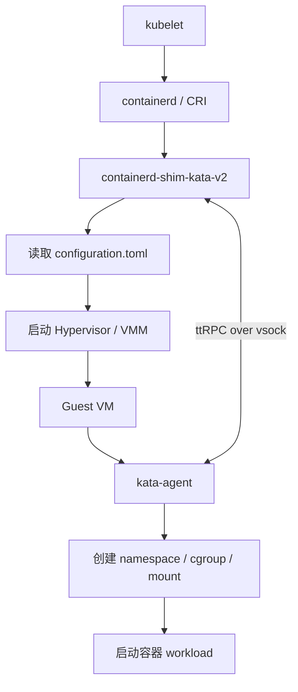

# Kata Containers 架构设计分析

> 来源仓库：`YIYUANYUAN1116/kata-containers`  
> 分析对象：Kata Containers README、architecture、virtualization、storage、runtime、agent、runtime-rs 等文档  
> 适合用途：学习 Kata 源码、理解 Pod 创建链路、分析 virtio-fs / virtio-blk / virtio-scsi / PMEM / DAX 在架构中的位置。

---

## 1. 项目定位

Kata Containers 的目标是：**让容器像普通 Linux 容器一样使用，但隔离边界接近虚拟机**。

普通容器主要依赖 Linux namespace、cgroup、seccomp、capability 等机制隔离；Kata Containers 在此基础上增加了一层轻量虚拟机。也就是说，业务进程不是直接运行在宿主机 namespace 中，而是运行在一个 Guest VM 内部的容器环境中。

普通 runc 容器大概是：

```text
Kubernetes / containerd
        |
        v
runc
        |
        v
Host namespace + cgroup
        |
        v
container process
```

Kata Containers 大概是：

```text
Kubernetes / containerd
        |
        v
containerd-shim-kata-v2
        |
        v
QEMU / Cloud Hypervisor / Dragonball / Firecracker
        |
        v
Guest VM
        |
        v
kata-agent
        |
        v
container process inside VM
```

一句话总结：

```text
Kata runtime 在 Host 侧接 containerd 请求，
启动一个轻量 VM 作为 Pod sandbox，
通过 virtio 设备把网络、存储、通信映射进 VM，
再由 VM 内的 kata-agent 创建真正的容器环境并启动业务进程。
```

---

## 2. 总体架构分层

可以把 Kata Containers 拆成 5 层：

```text
┌────────────────────────────────────────────┐
│ Kubernetes / containerd / CRI-O             │
└─────────────────────┬──────────────────────┘
                      │ shimv2 / CRI / OCI
┌─────────────────────▼──────────────────────┐
│ Kata Runtime                                │
│ containerd-shim-kata-v2 / runtime-rs        │
└─────────────────────┬──────────────────────┘
                      │ 启动和管理 VM
┌─────────────────────▼──────────────────────┐
│ Hypervisor / VMM                            │
│ QEMU / Cloud Hypervisor / Firecracker /     │
│ Dragonball                                  │
└─────────────────────┬──────────────────────┘
                      │ virtio 设备 / vsock
┌─────────────────────▼──────────────────────┐
│ Guest VM                                    │
│ guest kernel + guest image/initrd           │
│ kata-agent                                  │
└─────────────────────┬──────────────────────┘
                      │ namespace / cgroup / mount
┌─────────────────────▼──────────────────────┐
│ Container workload                          │
│ 真正的业务进程，比如 nginx / bash / app      │
└────────────────────────────────────────────┘
```

各层职责如下：

| 层级 | 代表组件 | 作用 |
|---|---|---|
| 编排层 | Kubernetes、containerd、CRI-O | 接收用户创建 Pod / Container 请求 |
| Runtime 层 | `containerd-shim-kata-v2`、`runtime-rs` | 接 containerd 请求，准备 sandbox，启动 VM |
| VMM 层 | QEMU、Dragonball、Cloud Hypervisor、Firecracker | 创建和管理轻量 VM |
| Guest 层 | guest kernel、guest image、kata-agent | VM 内部系统，负责创建容器环境 |
| Workload 层 | nginx、bash、业务进程 | 用户真正要运行的容器进程 |

---

## 3. Pod、VM、Container 的映射关系

Kata 最核心的设计是：

```text
Pod Sandbox ≈ VM
Container   ≈ VM 内的一个进程/namespace/cgroup 环境
```

在 Kubernetes 场景下，通常不是“一个容器一个 VM”，而是：

```text
一个 Pod 一个 VM
一个 Pod 内可以有多个 Container
多个 Container 共享同一个 Guest VM
```

这和 Kubernetes 原生 Pod 模型比较吻合，因为 Pod 内多个容器本来就共享网络命名空间、volume 等资源。

---

## 4. 三种 rootfs：最容易混的地方

Kata 架构里至少有三层 rootfs：

| 环境 | rootfs 来源 | 说明 |
|---|---|---|
| Host | 宿主机系统 rootfs | 运行 containerd、shim、QEMU、virtiofsd |
| Guest VM | guest image / initrd | 用来启动 VM 的 mini OS |
| Container | 用户容器镜像 rootfs | 比如 busybox、ubuntu、nginx 镜像 |

重点：

```text
宿主机 rootfs
    != Guest VM rootfs
        != 容器 rootfs
```

`kata-containers.img` 或 initrd 是 Guest VM 启动用的 mini OS。  
`busybox`、`ubuntu`、`nginx` 等镜像是容器 workload 的 rootfs。

所以：

```text
kata-containers.img / initrd
    -> 给 Guest VM 启动用

busybox / ubuntu / nginx image
    -> 给容器进程运行用
```

---

## 5. Runtime 层设计

主要目录：

```text
src/runtime
src/runtime-rs
```

### 5.1 Go runtime

`src/runtime` 是 Go 版 runtime，主要包含：

| 二进制 | 作用 |
|---|---|
| `containerd-shim-kata-v2` | Kata 的 shimv2 runtime |
| `kata-runtime` | 工具程序，比如 `kata-runtime check/env` |
| `kata-monitor` | metrics 采集 |

Runtime 的主要职责：

```text
1. 接收 containerd 的 shimv2 请求
2. 读取 configuration.toml
3. 根据配置选择 hypervisor
4. 准备 guest kernel / guest image / initrd
5. 准备网络、存储、virtio-fs、block device
6. 启动 VM
7. 通过 vsock/ttRPC 和 guest 里的 kata-agent 通信
8. 让 agent 创建容器环境并拉起业务进程
9. 监听容器退出，清理 VM 和资源
```

### 5.2 Rust runtime：runtime-rs

`src/runtime-rs` 是 Kata 4.0 的 Rust runtime。

它的目标是：

```text
减少进程间通信
降低线程数量
提升启动速度
提升高密度场景下的资源效率
```

核心 crate：

| crate | 作用 |
|---|---|
| `shim` | containerd shim v2 入口 |
| `service` | containerd shim protocol 服务 |
| `runtimes` | VirtContainer / LinuxContainer / WasmContainer |
| `resource` | network、share_fs、rootfs、volume、cgroup |
| `hypervisor` | QEMU、Dragonball、Cloud Hypervisor 等 |
| `agent` | 和 Guest kata-agent 通信 |
| `persist` | sandbox 状态持久化 |

Rust runtime 的重点变化是：

```text
旧架构：
shimv2 process
    |
    | fork + IPC/RPC
    v
QEMU / Cloud Hypervisor / Firecracker process
    |
    v
Guest VM

新架构，Dragonball built-in 模式：
containerd-shim-kata-v2 单进程
    |
    | direct function call
    v
Dragonball VMM library
    |
    v
Guest VM
```

---

## 6. Shim v2 架构

Kata 使用 containerd shimv2 模型。

以前传统 runtime 模型可能会多次调用 runtime 二进制，容易造成状态管理复杂、性能开销大。

shimv2 的思路是：

```text
containerd 启动一个 shimv2 runtime 进程
containerd 通过 socket / ttrpc 和 shim 持续通信
shim 负责管理这个 Pod 对应的 VM 生命周期
```

Kata 中可以理解为：

```text
containerd
    |
    v
containerd-shim-kata-v2
    |
    v
一个 Pod 对应的 Guest VM
    |
    v
Pod 内多个容器进程
```

优点：

```text
1. 减少重复启动 runtime 的开销
2. 一个 shim 管一个 Pod/VM，状态更清晰
3. 支持 Pod 内多个容器共享一个 VM
4. 更贴合 Kubernetes Pod Sandbox 模型
```

---

## 7. Hypervisor / VMM 层

Kata 支持多个 hypervisor / VMM：

| Hypervisor | 特点 |
|---|---|
| QEMU | 最成熟，功能最全，多架构支持最好 |
| Cloud Hypervisor | Rust VMM，云原生场景 |
| Firecracker | 极简 microVM，serverless 场景 |
| Dragonball | Kata Rust runtime 内置 VMM，追求低开销和快启动 |

对当前学习 Kata + 鲲鹏 / ARM64 / virtio / PMEM 场景，重点还是：

```text
QEMU + KVM + virtio-fs / virtio-blk / virtio-scsi / NVDIMM
```

因为 QEMU 在多架构、设备模拟、兼容性上最完整。

---

## 8. Guest VM 与 kata-agent

主要目录：

```text
src/agent
```

`kata-agent` 是运行在 Guest VM 内的常驻进程。它在 VM 启动后运行，负责在 VM 内创建和管理容器生命周期。

可以这样理解：

```text
Host 侧：
containerd-shim-kata-v2 负责管理 VM

Guest 侧：
kata-agent 负责管理 VM 里面的容器
```

通信方式：

```text
runtime <--- ttRPC over vsock ---> kata-agent
```

容器创建不是宿主机直接 `runc create`，而是：

```text
Host containerd
    -> containerd-shim-kata-v2
        -> 启动 VM
            -> VM 内 kata-agent
                -> 在 VM 内创建 namespace/cgroup/mount
                    -> 启动容器进程
```

---

## 9. 从 Pod 创建到容器进程启动的完整链路

```text
1. kubelet 创建 Pod
        |
        v
2. containerd 接收 CRI 请求
        |
        v
3. containerd 根据 RuntimeClass 选择 io.containerd.kata.v2
        |
        v
4. 启动 containerd-shim-kata-v2
        |
        v
5. Kata runtime 读取 configuration.toml
        |
        v
6. Runtime 准备 sandbox：
   - VM 配置
   - CPU / memory
   - kernel / image / initrd
   - network
   - shared fs
   - block device
        |
        v
7. Runtime 启动 hypervisor：
   - QEMU / Dragonball / Cloud Hypervisor
        |
        v
8. Hypervisor 启动 Guest VM
        |
        v
9. Guest kernel 启动
        |
        v
10. Guest image/initrd 中启动 kata-agent
        |
        v
11. Runtime 通过 vsock + ttRPC 调 kata-agent
        |
        v
12. kata-agent 执行 CreateSandbox / CreateContainer
        |
        v
13. Guest 内创建：
    - mount namespace
    - pid namespace
    - cgroup
    - rootfs
    - mounts
        |
        v
14. agent 启动业务进程
        |
        v
15. workload 运行在 VM 内 container 环境中
```

简化成一张图：



---

## 10. 存储架构：virtio-fs、virtio-scsi、virtio-blk、NVDIMM

这是学习 Kata 时最容易混乱、也是当前工作最相关的部分。

Kata 的存储路径不是单一的，会根据 rootfs 类型、snapshotter、runtime 配置决定。

### 10.1 virtio-fs：文件系统共享路径

如果没有配置 block-based graph driver，Kata 通常会使用 `virtio-fs` 把 workload image 共享进 VM。

链路：

```text
Host container image rootfs
        |
        | virtiofsd
        v
Guest VM / kataShared
        |
        v
Container rootfs
```

所以容器内看到：

```bash
findmnt -T /
# / none virtiofs
```

这通常说明容器 `/` 是通过 `virtio-fs` 从 Host 共享进 Guest VM 的。

### 10.2 virtio-scsi / virtio-blk：块设备路径

如果 container rootfs 背后是 block-based graph driver，比如 devicemapper，Kata 可以把 block device 直接传进 VM。

链路：

```text
Host block device / image
        |
        | virtio-scsi / virtio-blk
        v
Guest VM /dev/vdX 或 /dev/sdX
        |
        v
Container rootfs
```

配置项中能看到：

```toml
block_device_driver = "virtio-scsi" / "virtio-blk" / "nvdimm"
```

理解：

```text
virtio-scsi / virtio-blk 更像“块设备映射”
virtio-fs 更像“文件系统目录共享”
```

### 10.3 PMEM / NVDIMM：Guest VM rootfs 或特殊块设备路径

QEMU 配置里有：

```toml
disable_image_nvdimm
```

其含义大概是：如果支持 nvdimm 且没有禁用，就可以用 nvdimm device 插入 guest image；否则使用 virtio-block。

链路大概是：

```text
Host guest image file
        |
        | NVDIMM / PMEM / DAX
        v
Guest VM /dev/pmem0 / /dev/pmem0p1
        |
        v
Guest VM rootfs
```

因此要区分：

```text
Guest VM rootfs 可能来自 /dev/pmem0p1
Container rootfs 可能仍然来自 virtio-fs
```

这也是之前测试里容易混的点。

---

## 11. virtio-fs、blk、scsi、pmem 的对比

| 技术 | 类型 | 典型用途 | 容器内现象 |
|---|---|---|---|
| virtio-fs | 共享文件系统 | 容器 rootfs / volume 共享 | `/` 可能显示 `virtiofs` |
| virtio-blk | 虚拟块设备 | block rootfs / 数据盘 | `/dev/vdX` |
| virtio-scsi | 虚拟 SCSI 块设备 | block rootfs / 多设备 hotplug | `/dev/sdX` 或相关块设备 |
| NVDIMM / PMEM | 持久内存设备 | Guest image / DAX / 特殊 rootfs | `/dev/pmem0`、`/dev/pmem0p1` |

简单理解：

```text
virtio-fs：
    Host 把目录共享给 Guest，Guest 内 agent 用它作为容器 rootfs 或 volume。

virtio-blk / virtio-scsi：
    Host 把块设备或镜像文件以虚拟块设备形式暴露给 Guest。

NVDIMM / PMEM：
    常用于把 guest image 作为 pmem/nvdimm 设备暴露给 Guest，DAX 相关。
```

---

## 12. 网络架构

Kata 把 CRI 的 Network 映射成 VM 内的虚拟网卡。

大致链路：

```text
Kubernetes CNI
    |
Host veth / tap / tc / route
    |
Hypervisor
    |
virtio-net / vhost-net
    |
Guest VM ethX
    |
Container netns
```

网络层不是当前 virtio-fs / PMEM 的核心，但要记住：

```text
Pod 网络本质上也要经过 VM 这一层
```

---

## 13. 架构优点

### 13.1 隔离更强

普通容器主要靠：

```text
namespace + cgroup + seccomp + capability
```

Kata 多了一层：

```text
hardware virtualization / KVM
```

所以容器逃逸时，不是直接到 Host，而是先被 VM 边界隔开。

### 13.2 兼容 Kubernetes / containerd

Kata 实现 shimv2 runtime，兼容 containerd、CRI-O、OCI。

Kubernetes 侧通常只需要使用 RuntimeClass：

```yaml
runtimeClassName: kata
```

### 13.3 一个 Pod 一个 VM，贴合 Pod 模型

Pod 内多容器共享同一个 VM，适合 Kubernetes 的 sandbox 语义。

### 13.4 hypervisor、存储、网络可替换

```text
Hypervisor:
    QEMU / Cloud Hypervisor / Firecracker / Dragonball

Storage:
    virtio-fs / virtio-scsi / virtio-blk / nvdimm / nydus

Network:
    virtio-net / vhost-net / physical / VFIO
```

---

## 14. 架构代价

### 14.1 启动链路更长

普通 runc：

```text
containerd -> runc -> process
```

Kata：

```text
containerd -> shim -> hypervisor -> guest kernel -> agent -> process
```

所以启动速度天然更复杂，需要通过这些方式优化：

```text
VM cache
VM template
initrd
Dragonball
runtime-rs async
减少设备初始化
```

### 14.2 存储路径复杂

普通容器直接在 Host 上 mount overlayfs。

Kata 要考虑：

```text
Host image layer 怎么进 Guest？
Guest VM rootfs 怎么启动？
Container rootfs 是 virtio-fs 还是 block？
Volume 怎么 hotplug？
```

所以 `virtio-fs vs virtio-blk vs virtio-scsi vs virtio-pmem` 本质都是 Host 到 Guest 的存储映射问题。

### 14.3 调试链路长

问题可能发生在：

```text
containerd
shimv2
runtime config
QEMU 参数
virtiofsd
guest kernel
kata-agent
container process
```

排查时必须分层。

例如容器内看到：

```bash
Filesystem none type virtiofs mounted on /
```

说明问题更可能在：

```text
shared_fs / virtiofsd / container rootfs mount
```

而不是 Guest VM 自己的 `/dev/pmem0p1` rootfs。

---

## 15. 源码阅读路线

### 第一阶段：先看文档

```text
README.md
docs/design/architecture/README.md
docs/design/architecture/storage.md
docs/design/virtualization.md
docs/design/architecture/guest-assets.md
```

目标：搞清楚三件事：

```text
Pod = VM
Container = VM 内进程
container rootfs != guest image rootfs
```

### 第二阶段：看 Runtime 入口

```text
src/runtime
src/runtime-rs
```

重点理解：

```text
containerd-shim-kata-v2
configuration.toml
hypervisor 选择
sandbox 创建
agent RPC 调用
```

Go runtime：

```text
src/runtime
src/runtime/virtcontainers
```

Rust runtime：

```text
src/runtime-rs/crates/shim
src/runtime-rs/crates/service
src/runtime-rs/crates/runtimes
src/runtime-rs/crates/resource
src/runtime-rs/crates/hypervisor
src/runtime-rs/crates/agent
```

### 第三阶段：看 Agent

```text
src/agent
src/libs/protocols/protos
```

重点看：

```text
CreateSandbox
CreateContainer
StartContainer
ExecProcess
WaitProcess
DestroySandbox
```

### 第四阶段：看存储和设备

重点目录和配置：

```text
src/runtime/config/configuration-qemu.toml.in
src/runtime/virtcontainers
src/runtime-rs/crates/resource
src/runtime-rs/crates/hypervisor
```

重点关键词：

```text
shared_fs
virtio_fs_daemon
virtio_fs_cache_size
virtio_fs_cache
disable_block_device_use
block_device_driver
disable_image_nvdimm
nvdimm
pmem
virtio-blk
virtio-scsi
```

---

## 16. 当前工作相关的主线

如果当前目标是分析 Kata + PMEM / DAX / ARM64 / virtio-fs 性能或漏洞问题，可以始终抓住这条主线：

```text
containerd 请求
  -> shimv2/runtime
    -> sandbox/VM
      -> hypervisor
        -> virtio 设备
          -> guest agent
            -> container workload
```

当前最相关的层是：

```text
Host ↔ Guest VM 资源映射层
```

也就是：

```text
Host
  |
  | containerd-shim-kata-v2
  |
  | QEMU / Dragonball
  |
  | virtio-fs     -> 文件系统共享，常用于容器 rootfs / volume
  | virtio-blk    -> 块设备映射
  | virtio-scsi   -> 块设备映射，常见默认 block driver
  | nvdimm/pmem   -> guest image / pmem rootfs / DAX 相关
  |
Guest VM
  |
  | kata-agent
  |
Container process
```

---

## 17. 参考文件

来自 `YIYUANYUAN1116/kata-containers`：

```text
README.md
docs/design/architecture/README.md
docs/design/architecture/storage.md
docs/design/virtualization.md
docs/design/architecture/guest-assets.md
src/runtime/README.md
src/runtime-rs/README.md
src/agent/README.md
src/runtime/config/configuration-qemu.toml.in
```
