# Kata + devmapper block rootfs：Pod 启动链路与 virtio-scsi / virtio-blk / virtio-pmem 对比

> 目标：说明 `containerd devmapper snapshotter -> /dev/dm-X -> Kata runtime -> QEMU -> guest -> kata-agent -> 容器 /` 的完整链路，并从 Kata/QEMU 源码解释三条块设备路径在当前 ARM64 环境中的成功或失败原因。

## 1. 实验环境与已验证现象

```text
架构：ARM64 / aarch64
Kubernetes + containerd
RuntimeClass：kata
snapshotter：devmapper
Kata：3.27.0
Hypervisor：QEMU 10.2.0 kata-static
machine：QEMU virt
```

宿主机已经观察到：

```text
containerd-devpool-snap-999  -> /dev/dm-17 -> ext4
containerd-devpool-snap-1000 -> /dev/dm-18 -> ext4

qemu-system-aarch64：
  fd 252 -> /dev/dm-17
  fd 253 -> /dev/dm-18
```

在 `block_device_driver="virtio-scsi"` 时，容器内观察到：

```text
/dev/sdb on / type ext4
```

因此已经确认成功链路：

```text
host /dev/dm-X
  -> QEMU
  -> virtio-scsi
  -> guest /dev/sdX
  -> kata-agent mount
  -> container /
```

---

## 2. 三条路径总览

| 路径 | QEMU 前端设备 | guest 设备 | 当前结果 | 代码级根因 |
|---|---|---|---|---|
| `virtio-scsi` | `scsi-hd` 挂到已有 `virtio-scsi-pci` controller | `/dev/sdX` | 成功 | controller 在 VM 启动时已存在，运行时只增加 SCSI disk |
| `virtio-blk` | 新增 `virtio-blk-pci` | 预期 `/dev/vdX` | 失败 | Kata 将设备分配到 `pci-bridge-0`，该 bridge 为 `shpc=off`，不支持 hotplug |
| `block_device_driver=nvdimm` | `memory-backend-file` + `nvdimm` | 预期 `/dev/pmemX` | 失败 | Kata 总是发送 `pmem` 属性，但当前 QEMU 未启用 `CONFIG_LIBPMEM`，QMP schema 不包含该字段 |
| 真正的 `virtio-pmem` | `virtio-pmem-pci` | `/dev/pmemX` | 当前不可用 | ARM QEMU `virt` 没有使能 `VIRTIO_PMEM_SUPPORTED`，当前二进制不存在该设备 |

> 注意：Kata 配置中的 `block_device_driver="nvdimm"` 不是 `virtio-pmem-pci` 路线。

---

## 3. virtio-scsi：完整成功路径


### 3.1 为什么成功

`virtio-scsi` 分为两层：

```text
PCI 层：virtio-scsi-pci controller
SCSI 层：controller 下面的 scsi-hd / scsi disk
```

VM 启动时，Kata 已经创建：

```text
virtio-scsi-pci controller
  -> scsi bus：scsi0.0
```

容器 rootfs `/dev/dm-X` 后续出现时，Kata 不需要再热插新的 PCI controller，只需要：

```text
QMP blockdev-add
  -> 注册 /dev/dm-X 为 QEMU block backend

QMP device_add scsi-hd
  -> 挂到已有 scsi0.0
```

Kata 3.27.0 源码中对应逻辑：

```go
case q.config.BlockDeviceDriver == config.VirtioSCSI:
    driver := "scsi-hd"
    bus := scsiControllerID + ".0"
    scsiID, lun, err := utils.GetSCSIIdLun(drive.Index)
    err = q.qmpMonitorCh.qmp.ExecuteSCSIDeviceAdd(
        q.qmpMonitorCh.ctx,
        drive.ID,
        devID,
        driver,
        bus,
        romFile,
        scsiID,
        lun,
        true,
        defaultDisableModern,
    )
```

核心区别：

```text
virtio-scsi 运行时增加的是“控制器下面的一块盘”，
不是向 PCI bus 再插一个新的 PCI 设备。
```

---

## 4. virtio-blk：完整失败路径

```mermaid
flowchart LR
    A["Kubernetes 创建 Pod"] --> B["devmapper 生成 /dev/dm-X"]
    B --> C["Kata 识别 block rootfs"]
    C --> D["block_device_driver = virtio-blk"]
    D --> E["QMP blockdev-add<br/>成功"]
    E --> F["q.arch.addDeviceToBridge<br/>types.PCI"]
    F --> G["返回 bridge.ID = pci-bridge-0"]
    G --> H["QMP device_add<br/>driver = virtio-blk-pci<br/>bus = pci-bridge-0"]
    H --> I["QEMU 检查 bridge hotplug 能力"]
    I --> J["pci-bridge-0 为 shpc=off"]
    J --> K["失败：Bus does not support hotplugging"]
    K --> L["guest 不会出现目标 /dev/vdX"]

    classDef ok fill:#e6ffed,stroke:#2da44e,color:#116329,stroke-width:2px;
    classDef fail fill:#fff1f0,stroke:#cf222e,color:#a40e26,stroke-width:2px;
    E:::ok
    K:::fail
    L:::fail
```



### 4.1 失败发生在哪一步

```text
QMP blockdev-add：成功
QMP device_add virtio-blk-pci：失败
```

这证明：

```text
/dev/dm-X 可以被 QEMU 打开；
失败的是 guest 前端 PCI 设备的创建和热插。
```

### 4.2 Kata 源码如何选择 bus

`hotplugAddBlockDevice()` 的 `VirtioBlock` 分支：

```go
case q.config.BlockDeviceDriver == config.VirtioBlock:
    driver := "virtio-blk-pci"

    addr, bridge, err := q.arch.addDeviceToBridge(
        ctx,
        drive.ID,
        types.PCI,
    )

    err = q.qmpMonitorCh.qmp.ExecutePCIDeviceAdd(
        q.qmpMonitorCh.ctx,
        drive.ID,
        devID,
        driver,
        addr,
        bridge.ID,
        romFile,
        queues,
        true,
        defaultDisableModern,
        iothreadID,
    )
```

关键点：

```text
1. 代码调用 addDeviceToBridge(..., types.PCI)
2. 得到 addr 和 bridge
3. 将 bridge.ID 原样传给 ExecutePCIDeviceAdd
4. QMP 最终得到 bus = bridge.ID
```

通用 bridge 分配逻辑：

```go
func genericAddDeviceToBridge(
    ctx context.Context,
    bridges []types.Bridge,
    ID string,
    t types.Type,
) (uint32, types.Bridge, error) {
    for _, b := range bridges {
        if t != b.Type {
            continue
        }

        addr, err = b.AddDevice(ctx, ID)
        if err == nil {
            return addr, b, nil
        }
    }

    return 0, types.Bridge{}, fmt.Errorf("no more bridge slots available")
}
```

它只检查：

```text
bridge 类型是否匹配；
bridge 是否还有空地址。
```

它不会检查：

```text
该 bridge 是否支持运行时 PCI hotplug；
是否是 PCIe root port；
是否启用了 SHPC。
```

ARM64 又直接复用了通用 bridge 实现：

```go
func (q *qemuArm64) bridges(number uint32) {
    q.Bridges = genericBridges(number, q.qemuMachine.Type)
}
```

### 4.3 为什么明确是 Kata 的 bus 选择问题

同一个 `qemu.go` 中，ARM `QemuVirt` 的网络设备有专门逻辑：

```go
if machineType == QemuVirt {
    addr := "00"
    bridgeID := fmt.Sprintf(
        "%s%d",
        config.PCIeRootPortPrefix,
        len(config.PCIeDevicesPerPort[config.RootPort]),
    )

    return q.qmpMonitorCh.qmp.ExecuteNetPCIDeviceAdd(
        ...,
        addr,
        bridgeID,
        ...,
    )
}
```

即：

```text
ARM QemuVirt 网络设备 -> PCIe root port
ARM QemuVirt virtio-blk -> 通用 PCI bridge
```

当前实际 QMP：

```text
driver = virtio-blk-pci
bus = pci-bridge-0
```

而 QEMU 启动拓扑中的 bridge 是：

```text
pci-bridge-0, shpc=off
```

因此 QEMU 正常拒绝：

```text
Bus 'pci-bridge-0' does not support hotplugging
```

### 4.4 根因定性

```text
不是 ARM 不支持 virtio-blk；
不是 QEMU 不支持 virtio-blk；
不是 devmapper 的 /dev/dm-X 有问题。

而是 Kata 在 ARM64 QEMU virt 场景下，
对 virtio-blk rootfs 热插选择了不支持 hotplug 的 pci-bridge-0。
```

对应社区问题：

- [kata-containers #9912：virtio-blk device is plugged into the wrong PCI bus when running on ARM](https://github.com/kata-containers/kata-containers/issues/9912)

### 4.5 guest 系统盘与容器 virtio-blk rootfs 的区别

| 类型 | 设备何时确定 | 加入方式 | 是否需要 hotplug |
|---|---|---|---|
| Kata guest 系统盘 | QEMU 启动前已知 | QEMU 启动命令直接创建 | 否 |
| 容器 rootfs `/dev/dm-X` | 容器创建时由 snapshotter 准备 | VM 运行后 QMP `device_add` | 是 |

所以：

```text
Kata 启动前知道配置要求使用 virtio-blk；
但具体的 /dev/dm-X 是容器创建时才确定的；
因此容器 rootfs 仍需加入正在运行的 VM。
```

---

## 5. nvdimm / pmem：完整失败路径

```mermaid
flowchart LR
    A["devmapper 生成 /dev/dm-X"] --> B["Kata 识别 block rootfs"]
    B --> C["block_device_driver = nvdimm"]
    C --> D["读取 /dev/dm-X 容量"]
    D --> E["ExecuteNVDIMMDeviceAdd"]
    E --> F["QMP object-add<br/>qom-type = memory-backend-file<br/>mem-path = /dev/dm-X<br/>pmem = false 或 true"]
    F --> G["当前 QEMU QMP schema<br/>没有 pmem 属性"]
    G --> H["失败：Parameter 'pmem' is unexpected"]
    H --> I["未执行成功的 device_add nvdimm"]
    I --> J["guest 不会出现新的 rootfs /dev/pmemX"]

    classDef fail fill:#fff1f0,stroke:#cf222e,color:#a40e26,stroke-width:2px;
    H:::fail
    I:::fail
    J:::fail
```



### 5.1 Kata 实际走的不是 virtio-pmem

配置：

```toml
block_device_driver = "nvdimm"
```

对应源码判断：

```go
if q.config.BlockDeviceDriver == config.Nvdimm || drive.Pmem {
    ...
    err = q.qmpMonitorCh.qmp.ExecuteNVDIMMDeviceAdd(
        q.qmpMonitorCh.ctx,
        drive.ID,
        drive.File,
        blocksize,
        &drive.Pmem,
    )
}
```

这条路实际构造：

```text
memory-backend-file
  -> nvdimm
```

不是：

```text
memory-backend-file
  -> virtio-pmem-pci
```

### 5.2 `pmem` 参数究竟放在哪里

`ExecuteNVDIMMDeviceAdd()`：

```go
func (q *QMP) ExecuteNVDIMMDeviceAdd(
    ctx context.Context,
    id,
    mempath string,
    size int64,
    pmem *bool,
) error {
    args := map[string]interface{}{
        "qom-type": "memory-backend-file",
        "id":       "nvdimmbackmem" + id,
        "mem-path": mempath,
        "size":     size,
        "share":    true,
    }

    if pmem != nil {
        args["pmem"] = *pmem
    }

    err := q.executeCommand(ctx, "object-add", args, nil)
    if err != nil {
        return err
    }

    args = map[string]interface{}{
        "driver": "nvdimm",
        "id":     "nvdimm" + id,
        "memdev": "nvdimmbackmem" + id,
    }

    return q.executeCommand(ctx, "device_add", args, nil)
}
```

因此需要修正一个容易产生的误解：

```text
pmem 并没有被放到 device_add nvdimm；
pmem 被放在 object-add memory-backend-file。
```

实际第一条 QMP 类似：

```json
{
  "execute": "object-add",
  "arguments": {
    "qom-type": "memory-backend-file",
    "id": "nvdimmbackmem...",
    "mem-path": "/dev/dm-17",
    "size": 10737418240,
    "share": true,
    "pmem": false
  }
}
```

### 5.3 为什么即使 `drive.Pmem=false` 也会发送字段

调用传入的是：

```go
&drive.Pmem
```

这是一个非 `nil` 指针。因此：

```go
if pmem != nil {
    args["pmem"] = *pmem
}
```

一定成立。

所以无论值是：

```text
pmem = true
```

还是：

```text
pmem = false
```

Kata 都会把 `pmem` 字段发送给 QEMU。

### 5.4 QEMU 为什么不认识该字段

QEMU 的 QAPI 定义中，`MemoryBackendFileProperties` 的 `pmem` 属性受条件编译控制：

```text
pmem: bool，只有 CONFIG_LIBPMEM 时存在
```

对应定义：

```text
'*pmem': { 'type': 'bool', 'if': 'CONFIG_LIBPMEM' }
```

因此：

```text
QEMU 编译时启用 CONFIG_LIBPMEM：
  memory-backend-file 支持 pmem 属性

QEMU 编译时未启用 CONFIG_LIBPMEM：
  QMP schema 中完全没有 pmem 属性
```

当前 QEMU 返回：

```text
Parameter 'pmem' is unexpected
```

从源码和 QMP schema 可以判断：

```text
当前 /opt/kata/bin/qemu-system-aarch64
没有启用 CONFIG_LIBPMEM。
```

于是形成必现链路：

```text
Kata 总是发送 pmem 字段
  +
QEMU schema 没有 pmem 字段
  =
object-add memory-backend-file 失败
```

日志中的：

```text
Failed to add NVDIMM device /dev/dm-17
```

是外层函数对整个 `ExecuteNVDIMMDeviceAdd()` 的统一错误包装。具体失败点实际上可能是第一步：

```text
object-add memory-backend-file
```

而不是第二步：

```text
device_add nvdimm
```

### 5.5 根因定性

```text
不是 /dev/dm-X 无法使用；
不是 nvdimm device 参数里应该有 pmem；
不是 ARM guest 完全不认识 PMEM。

而是 Kata 3.27.0 总是向 memory-backend-file 发送 pmem 属性，
但当前 Kata static QEMU ARM64 构建未启用 CONFIG_LIBPMEM，
导致 QMP object-add 参数校验失败。
```

---

## 6. 为什么真正的 virtio-pmem-pci 当前也不可用

本地检查：

```text
qemu-system-aarch64 -device virtio-pmem-pci,help
  -> Device 'virtio-pmem-pci' not found
```

QEMU 构建规则：

```text
virtio-pmem.c     仅在 CONFIG_VIRTIO_PMEM 时编译
virtio-pmem-pci.c 仅在 CONFIG_VIRTIO_PMEM 时编译
```

而 `CONFIG_VIRTIO_PMEM` 依赖：

```text
VIRTIO_PMEM_SUPPORTED
```

该能力必须由具体 board/machine 主动选择。当前 QEMU ARM `virt` machine 没有选择该能力，因此 aarch64 system emulator 中没有注册：

```text
virtio-pmem-pci
```

所以当前环境没有一条可以直接切换的真正 virtio-pmem rootfs 路线：

```text
block_device_driver=nvdimm
  -> 传统 NVDIMM 路线

virtio-pmem-pci
  -> 当前 ARM QEMU 二进制不存在
```

---

## 7. ARM64 上的额外 DAX 限制

Kata ARM64 源码中明确写着：

```go
// DAX is disabled on ARM due to a kernel panic in caches_clean_inval_pou.
dax: false,
```

这不是当前 `Parameter 'pmem' is unexpected` 的直接原因，因为当前失败发生在 QEMU QMP 参数解析阶段，设备还没有进入 guest。

但它说明：

```text
即使修复 QEMU CONFIG_LIBPMEM 或 Kata 的参数兼容问题，
ARM64 上 NVDIMM + DAX 路线仍有额外的历史架构限制和风险。
```

---

## 8. 三条路径的代码级差异

| 路径 | Kata 运行时动作 | QMP/设备动作 | 当前结果 |
|---|---|---|---|
| `virtio-scsi` | 计算 SCSI ID/LUN | `device_add scsi-hd,bus=scsi0.0` | 成功 |
| `virtio-blk` | `addDeviceToBridge(types.PCI)` | `device_add virtio-blk-pci,bus=pci-bridge-0` | bridge 不支持 hotplug |
| `nvdimm` | `ExecuteNVDIMMDeviceAdd(...,&drive.Pmem)` | `object-add memory-backend-file,pmem=...` | QEMU schema 不含 pmem |
| `virtio-pmem` | 当前 Kata block driver 未使用该设备模型 | 需要 `virtio-pmem-pci` | ARM QEMU 当前不存在该设备 |

---

## 9. 当前实验最终结论

```text
1. devmapper 工作正常：
   已创建 /dev/dm-17、/dev/dm-18，且均为 ext4。

2. virtio-scsi 成功：
   QEMU 通过已有 virtio-scsi controller 增加 SCSI disk，
   guest 生成 /dev/sdX，容器 / 挂载自 /dev/sdb。

3. virtio-blk 失败：
   Kata 的 ARM64 block hotplug 代码走通用 PCI bridge 分配，
   将 virtio-blk-pci 插到 pci-bridge-0；该 bridge shpc=off，QEMU 正常拒绝热插。

4. nvdimm 失败：
   Kata 总是向 memory-backend-file 的 object-add 发送 pmem 属性，
   当前 QEMU 未启用 CONFIG_LIBPMEM，QMP schema 不认识该字段。

5. 真正的 virtio-pmem 当前不可用：
   ARM QEMU virt 未使能 VIRTIO_PMEM_SUPPORTED，当前二进制不存在 virtio-pmem-pci。
```

最短总结：

```text
virtio-scsi：已有 controller 下加盘，成功。
virtio-blk：Kata 选到了不支持 hotplug 的 bus，失败。
nvdimm：Kata 发送 pmem 字段，但 QEMU 构建没有 CONFIG_LIBPMEM，失败。
virtio-pmem：当前 ARM QEMU 根本没有该设备模型。
```
