# Kata + devmapper block rootfs：Pod 启动链路与 virtio-scsi / virtio-blk / virtio-pmem 对比

> 目标：把 `containerd devmapper snapshotter -> /dev/dm-X -> Kata runtime -> QEMU -> guest -> kata-agent -> 容器 /` 这条链路讲清楚，并对比 `virtio-scsi`、`virtio-blk`、`virtio-pmem/nvdimm` 三条路径在当前 ARM64 + QEMU virt 环境下的结果。

## 1. 当前实验环境与核心现象

当前环境大致为：

```text
ARM64 / aarch64
Kubernetes + containerd
RuntimeClass = kata
containerd snapshotter = devmapper
Kata runtime = io.containerd.kata.v2
Hypervisor = QEMU / qemu-system-aarch64
rootfs block device 来源 = containerd devmapper thin snapshot
```

当前已经验证到的关键现象：

```text
containerd-devpool-snap-999  -> /dev/dm-17 -> ext4
containerd-devpool-snap-1000 -> /dev/dm-18 -> ext4

qemu-system-aarch64 PID 85763:
  fd 252 -> /dev/dm-17
  fd 253 -> /dev/dm-18

容器内：
  /dev/sdb on / type ext4
```

这说明在 `block_device_driver="virtio-scsi"` 场景下，容器 rootfs 主体已经不是 virtio-fs 共享目录，而是 guest 内的 SCSI 块设备：

```text
host /dev/dm-X -> QEMU -> virtio-scsi -> guest /dev/sdX -> kata-agent mount -> container /
```

---

## 2. 三条路径总览

| 路径 | 宿主 rootfs 来源 | QEMU 暴露方式 | guest 设备形态 | 当前结果 | 失败/成功点 |
|---|---|---|---|---|---|
| `virtio-scsi` | `/dev/dm-X` | `virtio-scsi-pci controller` + SCSI disk | `/dev/sdX` | 成功 | 容器 `/` 挂载自 `/dev/sdb` |
| `virtio-blk` | `/dev/dm-X` | 新增 `virtio-blk-pci` 设备 | 预期 `/dev/vdX` | 失败 | `device_add virtio-blk-pci` 插到 `pci-bridge-0`，bus 不支持 hotplug |
| `virtio-pmem / nvdimm` | `/dev/dm-X` | NVDIMM / PMEM 设备 | 预期 `/dev/pmemX` | 失败 | QMP 参数解析失败：`Parameter 'pmem' is unexpected` |

---

## 3. 图 1：virtio-scsi 完整 Pod 启动链路（成功路径）

```mermaid
flowchart LR
    subgraph K8S[1. Kubernetes / CRI]
        A1[Pod 创建请求<br/>RuntimeClass=kata<br/>容器：unixbench]
        A2[RunPodSandbox<br/>创建 PodSandbox]
        A3[CreateContainer<br/>创建业务容器 unixbench]
        A1 --> A2 --> A3
    end

    subgraph CTD[2. containerd / devmapper snapshotter]
        B0[containerd + devmapper snapshotter<br/>thin pool：containerd-devpool<br/>metadata：_tmeta<br/>data：_tdata]
        B1[PodSandbox rootfs snapshot<br/>snapshotKey: sandbox<br/>thin snapshot -> /dev/dm-17<br/>ext4]
        B2[业务容器 rootfs snapshot<br/>snapshotKey: unixbench<br/>thin snapshot -> /dev/dm-18<br/>ext4]
        B0 --> B1
        B0 --> B2
    end

    subgraph KATA[3. Kata runtime / shim]
        C0[containerd-shim-kata-v2 / virtcontainers]
        C1[读取 OCI / CRI 信息]
        C2[识别 rootfs source 为块设备]
        C3[判断 /dev/dm-17、/dev/dm-18 为 block rootfs]
        C4[根据配置选择<br/>block_device_driver = virtio-scsi]
        C5[为每个 rootfs 创建 Kata block device 对象]
        C6[调用 QMP 热插块设备]
        C0 --> C1 --> C2 --> C3 --> C4 --> C5 --> C6
    end

    subgraph QEMU[4. QEMU / Hypervisor]
        D0[QEMU 启动虚机]
        D1[virtio-scsi-pci controller<br/>启动时已存在]
        D2[QMP blockdev-add<br/>把 /dev/dm-17、/dev/dm-18<br/>注册为 block backend]
        D3[QMP device_add<br/>以 scsi disk 形式挂到<br/>已有 virtio-scsi controller 下]
        D4[host /dev/dm-17<br/>-> guest /dev/sda]
        D5[host /dev/dm-18<br/>-> guest /dev/sdb]
        D0 --> D1 --> D2 --> D3
        D3 --> D4
        D3 --> D5
    end

    subgraph GUEST[5. Guest VM：guest kernel + kata-agent]
        E1[guest kernel<br/>识别 virtio-scsi controller<br/>SCSI 扫描<br/>生成 /dev/sda、/dev/sdb]
        E2[kata-agent<br/>等待块设备出现<br/>匹配 rootfs 对应 guest 设备<br/>mount ext4 rootfs<br/>准备 OCI rootfs<br/>调用 guest 内 runc/libcontainer]
        E1 --> E2
    end

    subgraph CONTAINER[6. 容器视角]
        F1[容器 mount namespace]
        F2[/dev/sdb on / type ext4]
        F3[根文件系统主体：block rootfs<br/>Kubernetes 注入文件：/etc/hosts、/etc/resolv.conf 等仍可走 virtio-fs]
        F1 --> F2 --> F3
    end

    A2 --> B1
    A3 --> B2
    B1 --> C0
    B2 --> C0
    C6 --> D2
    D4 --> E1
    D5 --> E1
    E2 --> F1

    OK1((成功)):::ok --> F2

    classDef ok fill:#e6ffed,stroke:#2da44e,color:#116329,stroke-width:2px;
```

### 3.1 virtio-scsi 为什么成功

`virtio-scsi` 的关键特点是：**VM 启动时先创建一个 virtio-scsi 控制器，后续容器 rootfs 来了，只需要把磁盘挂到这个已有控制器下面。**

也就是：

```text
VM 启动时：
  pcie.0
    -> virtio-scsi-pci controller

容器创建时：
  host /dev/dm-17 -> QEMU block backend -> scsi disk -> guest /dev/sda
  host /dev/dm-18 -> QEMU block backend -> scsi disk -> guest /dev/sdb
```

这条路径热插的是 **SCSI 磁盘**，不是新的 PCI 设备，所以不依赖 `pci-bridge-0` 的 hotplug 能力。

当前实测结果：

```text
容器内 mount：
  /dev/sdb on / type ext4

容器内 lsblk：
  sdb  挂载到 /
```

因此可以确认：

```text
/dev/dm-X 已经通过 virtio-scsi 成功进入 guest，并被 kata-agent 挂载为容器根文件系统。
```

---

## 4. 图 2：virtio-blk 完整 Pod 启动链路（当前环境失败路径）

```mermaid
flowchart LR
    subgraph K8S[1. Kubernetes / CRI]
        A1[Pod 创建请求<br/>RuntimeClass=kata<br/>容器：unixbench]
        A2[RunPodSandbox<br/>创建 PodSandbox]
        A3[CreateContainer<br/>创建业务容器 unixbench]
        A1 --> A2 --> A3
    end

    subgraph CTD[2. containerd / devmapper snapshotter]
        B0[containerd + devmapper snapshotter<br/>thin pool：containerd-devpool]
        B1[PodSandbox rootfs snapshot<br/>thin snapshot -> /dev/dm-17<br/>ext4]
        B2[业务容器 rootfs snapshot<br/>thin snapshot -> /dev/dm-18<br/>ext4]
        B3[到这里正常：devmapper 已成功生成块设备]:::ok
        B0 --> B1
        B0 --> B2
        B1 --> B3
        B2 --> B3
    end

    subgraph KATA[3. Kata runtime / shim]
        C0[containerd-shim-kata-v2 / virtcontainers]
        C1[读取 OCI / CRI 信息]
        C2[识别 /dev/dm-17、/dev/dm-18 为 block rootfs]
        C3[根据配置选择<br/>block_device_driver = virtio-blk]
        C4[为每个 rootfs 创建 Kata block device 对象]
        C5[调用 QMP：先创建 block backend]
        C6[再尝试热插 virtio-blk-pci 设备]
        C0 --> C1 --> C2 --> C3 --> C4 --> C5 --> C6
    end

    subgraph QEMU[4. QEMU / Hypervisor]
        D0[QEMU 启动虚机]
        D1[PCI 拓扑<br/>pcie-root-port<br/>pci-bridge-0: shpc=off]
        D2[QMP blockdev-add<br/>把 /dev/dm-17 / /dev/dm-18<br/>注册为 backend<br/>这一步成功]:::ok
        D3[QMP device_add<br/>driver = virtio-blk-pci<br/>bus = pci-bridge-0<br/>这一步失败]:::fail
        D4[报错位置：<br/>Bus 'pci-bridge-0' does not support hotplugging]:::fail
        D5[理论目标：host /dev/dm-18 -> guest /dev/vdb<br/>实际：未成功进入 guest]:::fail
        D0 --> D1 --> D2 --> D3 --> D4 --> D5
    end

    subgraph GUEST[5. Guest VM：guest kernel + kata-agent]
        E1[guest kernel<br/>未等到新的 virtio-blk rootfs 设备<br/>不会出现目标 /dev/vdX]:::warn
        E2[kata-agent<br/>因为 QMP device_add 已失败<br/>没有可用的 guest rootfs 块设备<br/>后续匹配 / mount 无法继续]:::warn
        E1 --> E2
    end

    subgraph CONTAINER[6. 容器视角]
        F1[容器 rootfs 未建立]:::fail
        F2[预期：/dev/vdX on / type ext4<br/>实际：QMP 热插阶段失败<br/>结果：PodSandbox / 容器创建失败]:::fail
        F1 --> F2
    end

    A2 --> B1
    A3 --> B2
    B3 --> C0
    C6 --> D2
    D5 --> E1
    E2 --> F1

    classDef ok fill:#e6ffed,stroke:#2da44e,color:#116329,stroke-width:2px;
    classDef fail fill:#fff1f0,stroke:#cf222e,color:#a40e26,stroke-width:2px;
    classDef warn fill:#fff8c5,stroke:#bf8700,color:#7d4e00,stroke-width:2px;
```



### 4.1 virtio-blk 为什么失败

`virtio-blk` 的关键特点是：**每一块盘本身就是一个新的 `virtio-blk-pci` 设备。**

所以容器 rootfs 来了以后，Kata 需要做的是：

```text
host /dev/dm-X
  -> QEMU block backend
  -> device_add virtio-blk-pci
  -> 插到某个 PCI/PCIe bus
  -> guest /dev/vdX
```

当前失败发生在 `device_add` 阶段：

```text
QMP blockdev-add：成功
QMP device_add virtio-blk-pci：失败
```

失败原因：

```text
Kata 把 virtio-blk-pci 设备插到了 pci-bridge-0；
pci-bridge-0 配置为 shpc=off，不支持 hotplug；
QEMU 拒绝 device_add。
```

对应报错：

```text
Bus 'pci-bridge-0' does not support hotplugging
```

该现象与 Kata 社区 issue #9912 高度一致：

- issue 标题：`virtio-blk device is plugged into the wrong PCI bus when running on ARM`
- 链接：https://github.com/kata-containers/kata-containers/issues/9912
- issue 中同样表现为：`blockdev-add` 成功，`device_add` 中 `driver=virtio-blk-pci`、`bus=pci-bridge-0`，最终因 bus 不支持 hotplug 失败。

### 4.2 guest 自己的 virtio-blk 系统盘与容器 rootfs virtio-blk 的区别

这里需要区分两类盘：

| 类型 | 什么时候确定 | 是否热插 | 典型 guest 设备 |
|---|---|---|---|
| Kata guest VM 系统盘 | QEMU 启动前已知，例如 `kata-containers.img` | 不是热插 | `/dev/vda1` |
| 容器 rootfs 盘 | 容器创建时由 devmapper snapshotter 生成 `/dev/dm-X` | 需要加入运行中的 VM | 预期 `/dev/vdX` |

所以不是说 Kata 不知道配置里写了 `virtio-blk`，而是：

```text
Kata 启动前知道：如果遇到 block rootfs，就用 virtio-blk 方式处理。
Kata 启动前不一定知道：具体哪个容器 rootfs 对应哪个 /dev/dm-X，以及什么时候创建。
```

因此容器 rootfs 的 `virtio-blk` 设备通常需要通过 QMP 加入运行中的 VM，这一步就是 PCI 设备热插。

---

## 5. 图 3：virtio-pmem / nvdimm 完整 Pod 启动链路（当前环境失败路径）

```mermaid
flowchart LR
    subgraph K8S[1. Kubernetes / CRI]
        A1[Pod 创建请求<br/>RuntimeClass=kata<br/>容器：unixbench]
        A2[RunPodSandbox<br/>创建 PodSandbox]
        A3[CreateContainer<br/>创建业务容器 unixbench]
        A1 --> A2 --> A3
    end

    subgraph CTD[2. containerd / devmapper snapshotter]
        B0[containerd + devmapper snapshotter<br/>thin pool：containerd-devpool]
        B1[PodSandbox rootfs snapshot<br/>-> /dev/dm-17<br/>-> ext4]
        B2[业务容器 rootfs snapshot<br/>-> /dev/dm-18<br/>-> ext4]
        B3[到这里正常：devmapper block rootfs 已准备好]:::ok
        B0 --> B1
        B0 --> B2
        B1 --> B3
        B2 --> B3
    end

    subgraph KATA[3. Kata runtime / shim]
        C0[containerd-shim-kata-v2 / virtcontainers]
        C1[读取 OCI / CRI 信息]
        C2[识别 /dev/dm-17、/dev/dm-18 为 block rootfs]
        C3[选择 pmem 路线<br/>实验配置常写为 block_device_driver = nvdimm]
        C4[为 rootfs 创建 NVDIMM / PMEM 设备描述]
        C5[调用 QMP 试图添加 pmem 设备]
        C0 --> C1 --> C2 --> C3 --> C4 --> C5
    end

    subgraph QEMU[4. QEMU / Hypervisor]
        D0[QEMU 启动虚机]
        D1[当前环境观测<br/>能看到 nvdimm<br/>看不到 virtio-pmem-pci<br/>nvdimm 参数列表不包含 pmem]
        D2[尝试把 host /dev/dm-17、/dev/dm-18<br/>作为 pmem / nvdimm 路线加入虚机]
        D3[QMP device_add / Add NVDIMM device]:::warn
        D4[报错位置：Parameter 'pmem' is unexpected]:::fail
        D5[日志现象：Failed to add NVDIMM device /dev/dm-17]:::fail
        D6[理论目标：host /dev/dm-18 -> guest /dev/pmem0pX<br/>实际：未成功进入 guest]:::fail
        D0 --> D1 --> D2 --> D3 --> D4 --> D5 --> D6
    end

    subgraph GUEST[5. Guest VM：guest kernel + kata-agent]
        E1[guest kernel<br/>没有成功收到新的 pmem rootfs 设备<br/>不会形成目标 /dev/pmemX 供容器 rootfs 使用]:::warn
        E2[kata-agent<br/>因为 QMP 添加设备已失败<br/>没有可匹配的 pmem rootfs 设备<br/>无法继续 mount]:::warn
        E1 --> E2
    end

    subgraph CONTAINER[6. 容器视角]
        F1[容器 rootfs 未建立]:::fail
        F2[预期：/dev/pmemX 或 /dev/pmemXp1 on /<br/>实际：QMP 参数阶段失败<br/>结果：PodSandbox / 容器创建失败]:::fail
        F1 --> F2
    end

    A2 --> B1
    A3 --> B2
    B3 --> C0
    C5 --> D2
    D6 --> E1
    E2 --> F1

    classDef ok fill:#e6ffed,stroke:#2da44e,color:#116329,stroke-width:2px;
    classDef fail fill:#fff1f0,stroke:#cf222e,color:#a40e26,stroke-width:2px;
    classDef warn fill:#fff8c5,stroke:#bf8700,color:#7d4e00,stroke-width:2px;
```



### 5.1 virtio-pmem / nvdimm 为什么失败

当前实验里，口头上经常把 `virtio-pmem`、`nvdimm`、`pmem` 放在一起讨论，但在 QEMU 设备模型上要区分：

```text
virtio-pmem:
  需要 QEMU 支持 virtio-pmem-pci

nvdimm:
  传统 NVDIMM 设备模型，通常依赖 nvdimm + memdev 等参数
```

当前环境观测：

```text
-device virtio-pmem-pci,help
  -> Device 'virtio-pmem-pci' not found

-device nvdimm,help
  -> 能看到 nvdimm，但参数列表里没有 pmem
```

而 containerd 日志显示：

```text
Failed to add NVDIMM device /dev/dm-17
QMP command failed: Parameter 'pmem' is unexpected
```

因此失败点是：

```text
Kata 尝试通过 nvdimm / pmem 路径把 /dev/dm-X 加进 QEMU，
但当前 QEMU aarch64 的设备模型不接受 Kata 传入的 pmem 参数，
导致 QMP 参数解析阶段失败。
```

这和 virtio-blk 的失败不同：

```text
virtio-blk：失败在 PCI bus hotplug 能力。
nvdimm/pmem：失败在 QMP 参数兼容性。
```

---

## 6. 三条路径的关键差异

### 6.1 virtio-scsi：先有 controller，后挂盘

```text
VM 启动时：
  创建 virtio-scsi-pci controller

容器 rootfs 创建时：
  /dev/dm-X -> scsi disk -> 挂到已有 controller
```

关键点：

```text
热插的是 SCSI 磁盘，不是新的 PCI 设备。
```

所以它不会踩到 `pci-bridge-0` 不支持 hotplug 的问题。

### 6.2 virtio-blk：每块盘都是新的 PCI 设备

```text
容器 rootfs 创建时：
  /dev/dm-X -> virtio-blk-pci -> 插到 PCI/PCIe bus
```

关键点：

```text
热插的是新的 virtio-blk-pci PCI 设备。
```

所以它依赖目标 bus 支持 hotplug。当前失败是因为：

```text
bus = pci-bridge-0
pci-bridge-0 = shpc=off
不支持 hotplug
```

### 6.3 virtio-pmem / nvdimm：PMEM 设备模型兼容性更复杂

```text
容器 rootfs 创建时：
  /dev/dm-X -> NVDIMM / PMEM device -> guest /dev/pmemX
```

但当前 QEMU aarch64 环境：

```text
没有 virtio-pmem-pci；
nvdimm 参数列表不接受 pmem；
Kata 传入 pmem 参数后 QMP 直接拒绝。
```

---

## 7. 从性能角度理解 block rootfs

### 7.1 virtio-fs rootfs 路径

```text
容器进程
  -> guest VFS
  -> virtio-fs
  -> virtiofsd
  -> host filesystem
```

metadata、open/close、exec、shell 等高频路径容易受 virtiofsd/FUSE 边界影响。

### 7.2 virtio-scsi block rootfs 路径

```text
容器进程
  -> guest VFS
  -> guest ext4
  -> virtio-scsi block
  -> QEMU
  -> host /dev/dm-X
```

文件系统逻辑主要在 guest 内部完成，减少了 virtiofsd 的文件级元数据往返。

因此，在 UnixBench 这类包含大量 filecopy、exec、shell、open/close 的测试里，block rootfs 可能明显优于 virtio-fs rootfs。

---

## 8. 当前实验结论

```text
1. devmapper 这层是正常的：
   containerd 已经通过 thin pool 创建出 /dev/dm-17、/dev/dm-18，且都是 ext4 文件系统。

2. virtio-scsi 路径是成功的：
   QEMU 打开 /dev/dm-X，通过 virtio-scsi 暴露为 guest /dev/sdX，容器内最终显示 /dev/sdb on / type ext4。

3. virtio-blk 路径当前失败：
   blockdev-add 成功，但 device_add virtio-blk-pci 被插到 pci-bridge-0；该 bus shpc=off，不支持 hotplug。

4. virtio-pmem / nvdimm 路径当前失败：
   Kata 尝试添加 NVDIMM / PMEM 设备时，QEMU 返回 Parameter 'pmem' is unexpected，说明当前 QEMU aarch64 的 nvdimm / pmem 参数路径不兼容。
```

最终一句话：

```text
Kata block rootfs 的本质是：containerd devmapper 在宿主机生成 /dev/dm-X，Kata runtime 根据 block_device_driver 选择虚拟设备模型，再由 QEMU 暴露给 guest，最后 kata-agent 在 guest 内挂载为容器 /。

当前环境下，virtio-scsi 路径完整成功；virtio-blk 卡在 PCI hotplug bus；virtio-pmem/nvdimm 卡在 QMP 参数兼容性。
```
