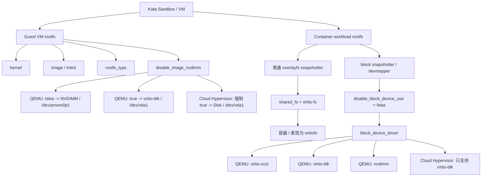
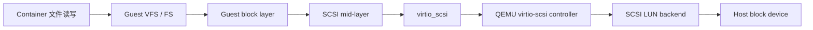
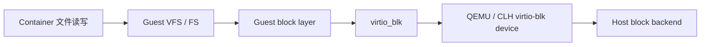

# Kata Containers 存储路径：virtio-scsi、virtio-blk、NVDIMM、virtio-fs 与 Guest rootfs 关系

> 目标：把 Kata Containers 里容易混淆的几个配置项讲清楚：`block_device_driver`、`disable_image_nvdimm`、`shared_fs = "virtio-fs"` 分别管什么；Guest VM rootfs 和容器 rootfs 是什么关系；QEMU 和 Cloud Hypervisor 在 `disable_image_nvdimm` 上有什么源码差异。

---

## 1. 先给结论

Kata 里至少要分清三条路径：

```text
1. Guest VM rootfs
   = Kata 小虚拟机自己的根文件系统
   = kata-containers.img / initrd 这类 Guest asset

2. Container workload rootfs
   = 业务容器看到的 /
   = busybox/nginx/ubuntu 等容器镜像展开后的 rootfs

3. Host <-> Guest shared filesystem
   = Host 目录如何共享进 Guest
   = 普通 overlayfs snapshotter 场景下，容器 rootfs 通常通过 virtio-fs 进 Guest
```

三个关键配置项分别对应：

| 配置项 | 主要管谁 | 作用 |
|---|---|---|
| `image` / `initrd` | Guest VM rootfs | 指定 Guest VM 启动用的 rootfs image 或 initrd |
| `rootfs_type` | Guest VM rootfs | 指定 Guest image 的文件系统类型，如 `ext4` / `xfs` / `erofs` |
| `disable_image_nvdimm` | Guest VM rootfs 插入方式 | QEMU 下决定 Guest image 用 NVDIMM 还是 virtio-blk；Cloud Hypervisor 下强制禁用 NVDIMM |
| `shared_fs` / `virtio_fs_*` | Host 与 Guest 共享文件系统 | 决定使用 `virtio-fs` / `virtio-9p` / `virtio-fs-nydus` / `none` 等共享方式 |
| `disable_block_device_use` | Container rootfs | 容器 rootfs 背后是块设备时，是否直接把块设备传给 Guest |
| `block_device_driver` | Container rootfs block path | 容器 rootfs 是块设备时，用 `virtio-scsi` / `virtio-blk` / `nvdimm` 哪种设备模型暴露给 Guest |

最重要的一句话：

```text
Guest VM rootfs 不是由 block_device_driver 决定的。

Guest VM rootfs 主要由 image/initrd 指定，
再由 disable_image_nvdimm 决定 image 是走 NVDIMM 还是 virtio-blk。

block_device_driver 管的是“容器 rootfs 背后是块设备”这个场景。
```

---

## 2. 三个容易混淆的问题

## 2.1 `block_device_driver` 是用于容器 rootfs 吗？

是。

Kata QEMU 配置模板里的注释大意是：

```toml
# Block storage driver to be used for the hypervisor in case the container
# rootfs is backed by a block device. This is virtio-scsi, virtio-blk
# or nvdimm.
block_device_driver = "..."
```

也就是说，`block_device_driver` 的触发前提是：

```text
container rootfs is backed by a block device
```

典型场景：

```text
containerd / CRI-O
  -> block-based snapshotter，例如 devmapper
  -> 每个容器 rootfs 背后有一个 block device
  -> Kata runtime 把这个 block device 交给 hypervisor
  -> block_device_driver 决定暴露方式
```

如果当前容器 `/` 是 `virtiofs`，例如：

```bash
findmnt -T / -o TARGET,SOURCE,FSTYPE,OPTIONS
# / none virtiofs rw,relatime
```

那说明当前容器 rootfs 走的是 `virtio-fs` 路径，不是 `block_device_driver` 路径。

---

## 2.2 Guest VM rootfs 由哪个参数决定？

Guest VM rootfs 主要由：

```toml
[hypervisor.qemu]
kernel = "..."
image = "..."
rootfs_type = "ext4"
```

或者：

```toml
initrd = "..."
```

来决定。

含义：

```text
kernel      = Guest VM 启动用的内核
image       = Guest VM 自己的 rootfs 镜像，例如 kata-containers.img
initrd      = 另一种 Guest rootfs 启动方式
rootfs_type = Guest image 的文件系统类型
```

Kata 文档也强调：Guest image 是 VM 启动用的最小 rootfs，和业务容器镜像无关。

例如你跑的是 busybox 容器：

```text
业务容器 rootfs = busybox 镜像
Guest VM rootfs = kata-containers.img 里的 mini OS
```

二者不是同一个 rootfs。

---

## 2.3 `virtio-fs` 参数决定了什么？

`shared_fs = "virtio-fs"` 决定 Host 和 Guest 之间使用 virtio-fs 共享文件系统。

配置相关项通常包括：

```toml
shared_fs = "virtio-fs"
virtio_fs_daemon = "..."
virtio_fs_cache_size = ...
virtio_fs_queue_size = ...
virtio_fs_cache = "auto"
virtio_fs_extra_args = []
```

它主要影响：

```text
1. 普通 overlayfs snapshotter 场景下，容器 rootfs 如何共享进 Guest
2. volume / bind mount / shared directory 如何共享进 Guest
3. virtiofsd daemon、cache、queue size、DAX cache 等 virtio-fs 行为
```

典型普通路径：

```text
Host overlayfs snapshotter
  -> virtiofsd
  -> QEMU / Cloud Hypervisor 的 virtio-fs device
  -> Guest 内挂载
  -> 容器看到 /
```

---

## 3. 一张总图



---

## 4. Guest VM rootfs：QEMU 和 Cloud Hypervisor 的差异

## 4.1 QEMU：`disable_image_nvdimm` 是有效开关

QEMU 下，Guest image 的设备插入逻辑大概是：

```text
image/initrd path
  -> ImageOrInitrdAssetPath()
  -> 如果是 ImageAsset
       -> q.arch.appendImage()
  -> appendImage() 根据 disable_image_nvdimm 决定
       -> NVDIMM
       -> 或 virtio-blk
```

源码路径：

```text
src/runtime/virtcontainers/qemu.go
src/runtime/virtcontainers/qemu_amd64.go
src/runtime/virtcontainers/qemu_arm64.go
src/runtime/virtcontainers/qemu_arch_base.go
src/runtime/virtcontainers/hypervisor.go
```

### QEMU x86_64

x86_64 的 `appendImage()` 逻辑：

```go
func (q *qemuAmd64) appendImage(ctx context.Context, devices []govmmQemu.Device, path string) ([]govmmQemu.Device, error) {
    if !q.disableNvdimm {
        return q.appendNvdimmImage(devices, path)
    }
    return q.appendBlockImage(ctx, devices, path)
}
```

结论：

```text
disable_image_nvdimm = false
  -> appendNvdimmImage()
  -> Guest root=/dev/pmem0p1


disable_image_nvdimm = true
  -> appendBlockImage()
  -> appendBlockDevice()
  -> Guest root=/dev/vda1
```

### QEMU arm64

arm64 的 `appendImage()` 逻辑也一样：

```go
func (q *qemuArm64) appendImage(ctx context.Context, devices []govmmQemu.Device, path string) ([]govmmQemu.Device, error) {
    if !q.disableNvdimm {
        return q.appendNvdimmImage(devices, path)
    }
    return q.appendBlockImage(ctx, devices, path)
}
```

但是 arm64 有一个关键差异：

```go
// DAX is disabled on ARM due to a kernel panic in caches_clean_inval_pou.
dax: false
```

所以：

```text
QEMU + arm64:
  Guest image 可以走 NVDIMM，即 /dev/pmem0p1
  但 DAX 在代码里是 false
  所以不能简单说它是完整的 PMEM + DAX 路径
```

### QEMU fallback 是 virtio-blk，不是 virtio-scsi

`appendBlockImage()` 最终走 `genericBlockDevice()`。

`genericBlockDevice()` 里 driver 是写死的：

```go
return govmmQemu.BlockDevice{
    Driver: govmmQemu.VirtioBlock,
    ...
}
```

所以对于 **Guest VM rootfs image** 来说：

```text
不是 NVDIMM -> virtio-blk
不是 NVDIMM -> virtio-scsi
```

这点非常重要。

`block_device_driver = "virtio-scsi"` 不会让 Guest VM rootfs image fallback 成 virtio-scsi。它影响的是容器 rootfs block device 的 hotplug 路径。

---

## 4.2 QEMU：Guest root 参数怎么切换

源码里 `GetKernelRootParams()` 定义了两个 root device：

```go
VirtioBlk = "/dev/vda1"
Nvdimm    = "/dev/pmem0p1"
```

逻辑是：

```go
if disableNvdimm {
    root=/dev/vda1
} else {
    root=/dev/pmem0p1
}
```

所以 QEMU 下 Guest rootfs 启动参数大致是：

```text
disable_image_nvdimm = false:
  root=/dev/pmem0p1


disable_image_nvdimm = true:
  root=/dev/vda1
```

如果开启 dm-verity，也会根据 `disableNvdimm` 在：

```text
/dev/pmem0p1 + /dev/pmem0p2
```

和：

```text
/dev/vda1 + /dev/vda2
```

之间切换。

---

## 4.3 QEMU：NVDIMM image 怎么加到 QEMU

`appendNvdimmImage()` 会把 Guest image 作为 memory backend file：

```go
object := govmmQemu.Object{
    Driver:   govmmQemu.NVDIMM,
    Type:     govmmQemu.MemoryBackendFile,
    DeviceID: "nv0",
    ID:       "mem0",
    MemPath:  path,
    Size:     imageSize,
    ReadOnly: true,
}
```

并且在 `handleImagePath()` 里，如果没有禁用 NVDIMM，会给 QEMU machine options 加：

```text
nvdimm=on
```

这说明 QEMU 下 Guest image 的 NVDIMM 路径本质是：

```text
Host kata-containers.img
  -> memory-backend-file
  -> QEMU NVDIMM device
  -> Guest /dev/pmem0p1
  -> Guest VM rootfs
```

---

## 4.4 QEMU：confidential guest 会强制禁用 NVDIMM

QEMU x86_64 和 arm64 都有类似逻辑：

```go
if config.ConfidentialGuest {
    if !q.disableNvdimm {
        warn("Nvdimm is not supported with confidential guest, disabling it.")
        q.disableNvdimm = true
    }
}
```

所以：

```text
confidential_guest = true
  -> NVDIMM 不支持
  -> Guest image fallback 到 virtio-blk
```

---

## 4.5 Cloud Hypervisor：`disable_image_nvdimm` 配置存在，但源码强制 true

Cloud Hypervisor 配置模板里也有：

```toml
# If false and nvdimm is supported, use nvdimm device to plug guest image.
# Otherwise virtio-block device is used.
#
# nvdimm is not supported with Cloud Hypervisor or when `confidential_guest = true`.
disable_image_nvdimm = ...
```

但源码 `setConfig()` 里直接写了：

```go
func (clh *cloudHypervisor) setConfig(config *HypervisorConfig) error {
    clh.config = *config

    // We don't support NVDIMM with Cloud Hypervisor.
    clh.config.DisableImageNvdimm = true

    return nil
}
```

也就是说：

```text
Cloud Hypervisor 下，即使配置文件写 disable_image_nvdimm = false，
源码也会强制改成 true。
```

---

## 4.6 Cloud Hypervisor：Guest image 固定作为 readonly raw disk

Cloud Hypervisor 创建 VM 时，代码里直接写：

```go
disableNvdimm := true
enableDax := false
```

然后用它们生成 Guest kernel root 参数。

之后如果 asset 是 image：

```go
disk := chclient.NewDiskConfig()
disk.Path = &assetPath
disk.SetReadonly(true)
disk.SetImageType("Raw")
```

并加入：

```go
clh.vmconfig.Disks = append(..., *disk)
```

所以 Cloud Hypervisor 的 Guest rootfs 路径是：

```text
Guest image
  -> Cloud Hypervisor DiskConfig
  -> readonly raw disk
  -> Guest root=/dev/vda1
```

不是：

```text
Guest image
  -> NVDIMM / PMEM
  -> /dev/pmem0p1
```

---

## 5. Guest VM rootfs 对比总结

| 对比项 | QEMU | Cloud Hypervisor |
|---|---|---|
| 配置项是否存在 | 有 `disable_image_nvdimm` | 有 `disable_image_nvdimm` |
| 是否真正支持 Guest image NVDIMM | 支持，取决于架构/配置/机密虚拟机 | 不支持 |
| `disable_image_nvdimm=false` | Guest image 走 NVDIMM | 源码强制改成 true |
| `disable_image_nvdimm=true` | Guest image 走 virtio-blk | Guest image 走 DiskConfig/virtio-blk 类路径 |
| Guest root device | `/dev/pmem0p1` 或 `/dev/vda1` | `/dev/vda1` |
| DAX | x86_64 代码里 `dax=true`；arm64 代码里 `dax=false` | `enableDax=false` |
| confidential guest | 强制禁用 NVDIMM | 本身不支持 NVDIMM |
| 是否受 `block_device_driver` 影响 | Guest image fallback 不受它影响，写死 virtio-blk | Guest image 不受它影响 |

---

## 6. Container rootfs：`block_device_driver` 三者对比

这部分才是 `virtio-scsi / virtio-blk / nvdimm` 三者对比的主要场景。

触发条件：

```text
容器 rootfs 背后是一个块设备
并且 disable_block_device_use = false
```

如果是普通 overlayfs snapshotter，通常会走 `virtio-fs`，而不是这条路径。

---

## 6.1 QEMU 下的 `block_device_driver`

QEMU 配置模板：

```toml
block_device_driver = "virtio-scsi"
# 可选 virtio-scsi / virtio-blk / nvdimm
```

三者含义：

| 方案 | 本质 | Guest 内常见设备形态 | 主要特点 |
|---|---|---|---|
| `virtio-scsi` | virtio SCSI HBA + LUN | `/dev/sdX`，实际以 `lsblk` 为准 | 通用、多盘、热插拔能力较好 |
| `virtio-blk` | 简单 virtio block device | `/dev/vdX` | 路径简单，单盘场景直接 |
| `nvdimm` | QEMU NVDIMM/PMEM device | `/dev/pmemX` | 可配合 DAX/PMEM，路径不同，限制也更多 |

---

## 6.2 Cloud Hypervisor 下的 `block_device_driver`

Cloud Hypervisor 配置模板里写的是：

```toml
# Block storage driver to be used for the hypervisor in case the container
# rootfs is backed by a block device. This is virtio-blk.
block_device_driver = "virtio-blk"
```

源码 hotplug block device 时也检查：

```go
if clh.config.BlockDeviceDriver != config.VirtioBlock {
    return fmt.Errorf("incorrect hypervisor configuration ... only support virtio-blk")
}
```

并且：

```go
if drive.Pmem {
    return fmt.Errorf("pmem device hotplug not supported")
}
```

所以 Cloud Hypervisor 下：

```text
Container rootfs block path:
  只支持 virtio-blk
  不支持 virtio-scsi
  不支持 pmem/nvdimm hotplug
```

---

## 6.3 `virtio-scsi`

一句话：`virtio-scsi` 是一个虚拟 SCSI 控制器，下面挂 LUN。



优点：

```text
1. 适合多盘、多 LUN
2. 热插拔和设备管理语义更完整
3. 更接近传统 VM 存储模型
4. Kata/QEMU 默认或常用 baseline 经常是它
```

缺点：

```text
1. 比 virtio-blk 多 SCSI mid-layer
2. 单盘场景不一定比 virtio-blk 更快
3. 性能受 QEMU、队列、IOThread、后端存储影响很大
```

---

## 6.4 `virtio-blk`

一句话：`virtio-blk` 是一个简单的 virtio 块设备。



优点：

```text
1. 设备模型简单
2. 路径短
3. 单盘或少量块设备场景直接
4. Cloud Hypervisor 对 container rootfs block path 只支持 virtio-blk
```

缺点：

```text
1. 多设备管理不如 virtio-scsi 灵活
2. SCSI 语义、复杂热插拔场景能力弱一些
3. 具体性能仍取决于队列、AIO、后端盘
```

---

## 6.5 `nvdimm`

一句话：`nvdimm` 是把后端文件/块设备以持久内存设备的方式暴露给 Guest。

```mermaid
flowchart LR
    A[Host backing file / block image] --> B[mmap / memory-backend-file]
    B --> C[QEMU NVDIMM device]
    C --> D[Guest physical address space]
    D --> E[Guest pmem driver]
    E --> F[/dev/pmemX]
    F --> G[Filesystem / DAX mount]
```

价值：

```text
1. 可配合 DAX，绕过传统 page cache
2. 对只读镜像、快速启动、XIP 类场景更有意义
3. 和 virtio-blk / virtio-scsi 不是单纯“谁更快”，而是 I/O 路径不同
```

限制：

```text
1. 架构支持有限
2. ARM64 代码里 Guest image DAX 被禁用
3. confidential guest 不支持 NVDIMM
4. Cloud Hypervisor 不支持 NVDIMM
5. 涉及 memory_offset、地址空间、安全边界、历史漏洞验证
```

---

## 7. `memory_offset` 是什么

QEMU 配置模板注释说明：

```toml
# The size in MiB will be plused to max memory of hypervisor.
# It is the memory address space for the NVDIMM device.
# If set block storage driver (block_device_driver) to "nvdimm",
# should set memory_offset to the size of block device.
memory_offset = 0
```

理解：

```text
NVDIMM 是映射到 Guest 物理地址空间的设备。
所以 VM 的最大内存地址空间要给 NVDIMM 预留一段区域。
```

注意：

```text
memory_offset 主要和 block_device_driver = nvdimm 的容器 rootfs block path 有关。
Guest image NVDIMM 也涉及 QEMU memory backend 和地址空间，但配置注释特别点名的是 block_device_driver=nvdimm 场景。
```

---

## 8. `virtio-fs` 和 block path 到底谁生效

你可以用下面的判断逻辑：

```text
容器内 / 是 virtiofs
  -> 当前容器 rootfs 走 shared_fs = virtio-fs
  -> block_device_driver 基本不是当前 / 的主路径

容器内 / 是 /dev/vdaX
  -> 可能是 virtio-blk 路径

容器内 / 是 /dev/sdaX
  -> 可能是 virtio-scsi 路径

容器内 / 是 /dev/pmemX
  -> 可能是 nvdimm / pmem 路径
```

检查命令：

```bash
findmnt -T / -o TARGET,SOURCE,FSTYPE,OPTIONS
cat /proc/mounts | grep -E 'virtiofs|pmem|vd|sd|dax'
lsblk -o NAME,MAJ:MIN,SIZE,FSTYPE,MOUNTPOINTS,MODEL
```

宿主机配置检查：

```bash
kata-runtime kata-env | grep -Ei 'image|initrd|rootfs_type|disable_image_nvdimm|shared_fs|virtio_fs|disable_block_device_use|block_device_driver|memory_offset'

CONF=/opt/kata/share/defaults/kata-containers/configuration-qemu.toml
grep -nE 'image|initrd|rootfs_type|disable_image_nvdimm|shared_fs|virtio_fs|disable_block_device_use|block_device_driver|memory_offset' "$CONF"
```

---

## 9. 和你当前测试现象的对应

你之前容器里看到：

```text
findmnt -T /:
/ none virtiofs rw,relatime

/proc/mounts:
none / virtiofs rw,relatime
```

这说明：

```text
业务容器 rootfs = virtio-fs
```

不是：

```text
业务容器 rootfs = virtio-scsi / virtio-blk / nvdimm
```

如果同时在容器里能看到 `/dev/pmem0p1`，那更可能是：

```text
Guest VM image 通过 NVDIMM 暴露给 Guest
然后容器因为特权/设备可见性，看到了 Guest rootfs 对应的 pmem 设备
```

这和业务容器 `/` 走 virtio-fs 不冲突。

也就是说，你当前可能是：

```text
Guest VM rootfs = /dev/pmem0p1
Container rootfs = virtiofs
```

这两件事可以同时成立。

---

## 10. 对 GHSA / PMEM-DAX 方案的理解口径

如果目标架构是：

```text
容器 rootfs = virtio-fs
Guest VM rootfs = PMEM/NVDIMM
容器内对 Guest rootfs 分区做 ro,dax 二次挂载测试
```

那你验证的是：

```text
1. Guest image 是否通过 NVDIMM/PMEM 暴露
2. /dev/pmem0p1 是否能在容器内被看见
3. DAX 是否真的生效
4. 只读挂载是否能防止写入
5. 是否还能复现 GHSA-wwj6-vghv-5p64 类问题
```

但它不等价于：

```text
业务容器 rootfs 本身走 PMEM+DAX
```

因为你的业务容器 `/` 仍然可能是 `virtiofs`。

---

## 11. 测试建议

## 11.1 每次测试先记录环境

宿主机：

```bash
kata-runtime kata-env > kata-env.txt
uname -a
qemu-system-aarch64 --version || qemu-system-x86_64 --version
containerd --version
crictl info | head -100
```

容器内：

```bash
findmnt -T / -o TARGET,SOURCE,FSTYPE,OPTIONS
lsblk -o NAME,MAJ:MIN,SIZE,FSTYPE,MOUNTPOINTS,MODEL
cat /proc/mounts | grep -E 'virtiofs|pmem|vd|sd|dax'
```

---

## 11.2 先区分你测的是哪条路径

| 你看到的现象 | 说明 |
|---|---|
| 容器 `/` 是 `virtiofs` | 测的是 virtio-fs 容器 rootfs 路径 |
| Guest kernel root 是 `/dev/pmem0p1` | Guest VM rootfs image 走 NVDIMM |
| Guest kernel root 是 `/dev/vda1` | Guest VM rootfs image 走 virtio-blk |
| 容器 `/` 是 `/dev/vdaX` | 容器 rootfs 可能走 virtio-blk block path |
| 容器 `/` 是 `/dev/sdX` | 容器 rootfs 可能走 virtio-scsi block path |
| mount options 有 `dax` | 文件系统层面 DAX 明确启用 |
| arm64 + QEMU | 需要注意源码里 Guest image DAX 是 false |
| Cloud Hypervisor | 不支持 Guest image NVDIMM，也不支持 PMEM hotplug |

---

## 11.3 性能测试不要只看 UnixBench

建议拆开：

| 目标 | 推荐工具 | 说明 |
|---|---|---|
| 启动速度 | pod 创建耗时、kata 日志、containerd 日志 | Guest image NVDIMM 可能更相关 |
| 块 I/O | fio | 对比 virtio-blk / virtio-scsi 更合适 |
| 小文件元数据 | 自定义 stat/open/read 脚本 | 对比 virtio-fs 与块设备 rootfs 更合适 |
| 综合系统性能 | UnixBench | 只能辅助观察，不能单独证明存储 driver 优劣 |
| DAX 是否生效 | findmnt / mount options | 必须确认 `dax` 是否出现在挂载参数里 |
| 安全验证 | GHSA probe | 验证只读、写穿透、host backing 是否受影响 |

---

## 12. 最终记忆版

```text
Guest VM rootfs:
  image/initrd 决定用哪个 Guest asset
  disable_image_nvdimm 决定 Guest image 插入方式

QEMU Guest image:
  disable_image_nvdimm=false -> NVDIMM -> /dev/pmem0p1
  disable_image_nvdimm=true  -> virtio-blk -> /dev/vda1
  fallback 不是 virtio-scsi

Cloud Hypervisor Guest image:
  源码强制 DisableImageNvdimm=true
  固定 disk/virtio-blk 类路径 -> /dev/vda1

Container rootfs:
  普通 overlayfs snapshotter -> shared_fs=virtio-fs -> 容器 / 是 virtiofs
  block snapshotter/devmapper -> block_device_driver 决定 virtio-scsi / virtio-blk / nvdimm

Cloud Hypervisor container rootfs block path:
  只支持 virtio-blk

virtio-fs:
  管 Host 与 Guest 的共享文件系统，不是 Guest image 的 NVDIMM 开关。
```

---

## 13. 源码/文档依据

主要参考 Kata Containers 仓库：

```text
src/runtime/config/configuration-qemu.toml.in
src/runtime/config/configuration-clh.toml.in
src/runtime/virtcontainers/hypervisor.go
src/runtime/virtcontainers/qemu.go
src/runtime/virtcontainers/qemu_amd64.go
src/runtime/virtcontainers/qemu_arm64.go
src/runtime/virtcontainers/qemu_arch_base.go
src/runtime/virtcontainers/clh.go
docs/design/architecture/guest-assets.md
docs/design/architecture/storage.md
```

关键源码点：

```text
1. GetKernelRootParams()
   disableNvdimm=true  -> root=/dev/vda1
   disableNvdimm=false -> root=/dev/pmem0p1

2. qemuAmd64.appendImage() / qemuArm64.appendImage()
   !disableNvdimm -> appendNvdimmImage()
   disableNvdimm  -> appendBlockImage()

3. genericBlockDevice()
   Driver: govmmQemu.VirtioBlock
   说明 Guest image fallback 是 virtio-blk

4. qemuArm64
   dax: false
   注释说明 ARM 上 DAX 因 kernel panic 被禁用

5. cloudHypervisor.setConfig()
   clh.config.DisableImageNvdimm = true
   说明 Cloud Hypervisor 强制不支持 NVDIMM

6. Cloud Hypervisor CreateVM()
   disableNvdimm := true
   enableDax := false
   image 作为 readonly raw DiskConfig 加入 vmconfig.Disks

7. Cloud Hypervisor hotplugAddBlockDevice()
   只接受 BlockDeviceDriver == VirtioBlock
   drive.Pmem 直接返回 pmem device hotplug not supported
```
